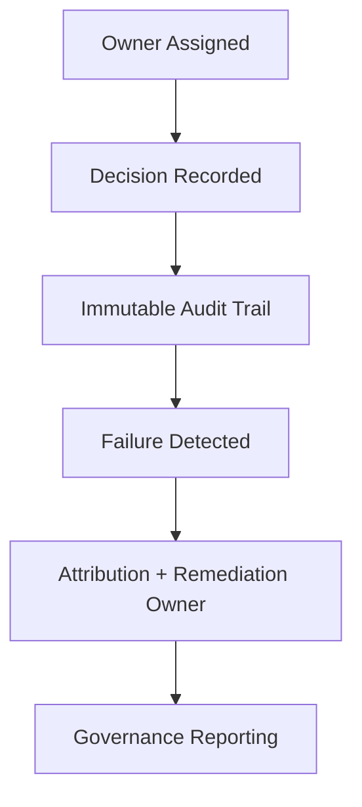

# Accountability — Process

Accountability ensures **ownership, traceability, and consequences** for decisions and actions in context-engineered systems.

It connects controls and outcomes to responsible humans.

---

## Ownership Mapping

- Each spec, control, check, skill, and acceptance decision has an **owner**.
- Owners must be named roles, not teams or “shared.”
- Ownership changes are recorded with timestamps and reasons.

---

## Decision Records

For each decision (acceptance, escalation resolution, override, control change):
- record decision, rationale, approver, date/time
- link to evidence and affected artifacts
- note trade-offs accepted and risks acknowledged

---

## Audit Trail

- Maintain immutable logs of decisions and key execution events.
- Include who executed, who approved, and what checks were run.
- Provenance and authority metadata must be retained.

---

## Failure Attribution

- When failures occur, trace to:
  - missing/failed controls or checks
  - ownership gaps
  - decision overrides
- Record remediation owners and deadlines.

---

## Reporting

- Regular reports on:
  - outstanding escalations and their status
  - expired acceptances
  - failed checks and remediation plans
  - ownership gaps

Reports go to governance owners; action is required, not optional.

---

## Status

This process is **stable**.  
Changes require governance approval and must not dilute ownership or auditability.
