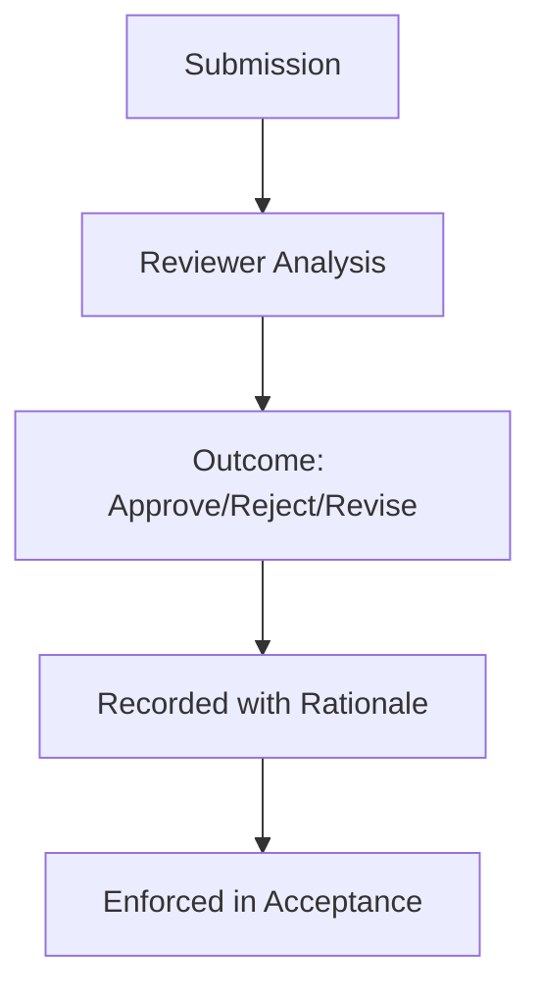

# Review — Index

Review is the **governed inspection of specs, controls, and outputs** before they are accepted.

This section will define:
- what must be reviewed (intent, controls, evidence)
- who can approve or reject
- how review outcomes are recorded and enforced

Review documents make explicit the authority and criteria for acceptance. They do not add new controls.
