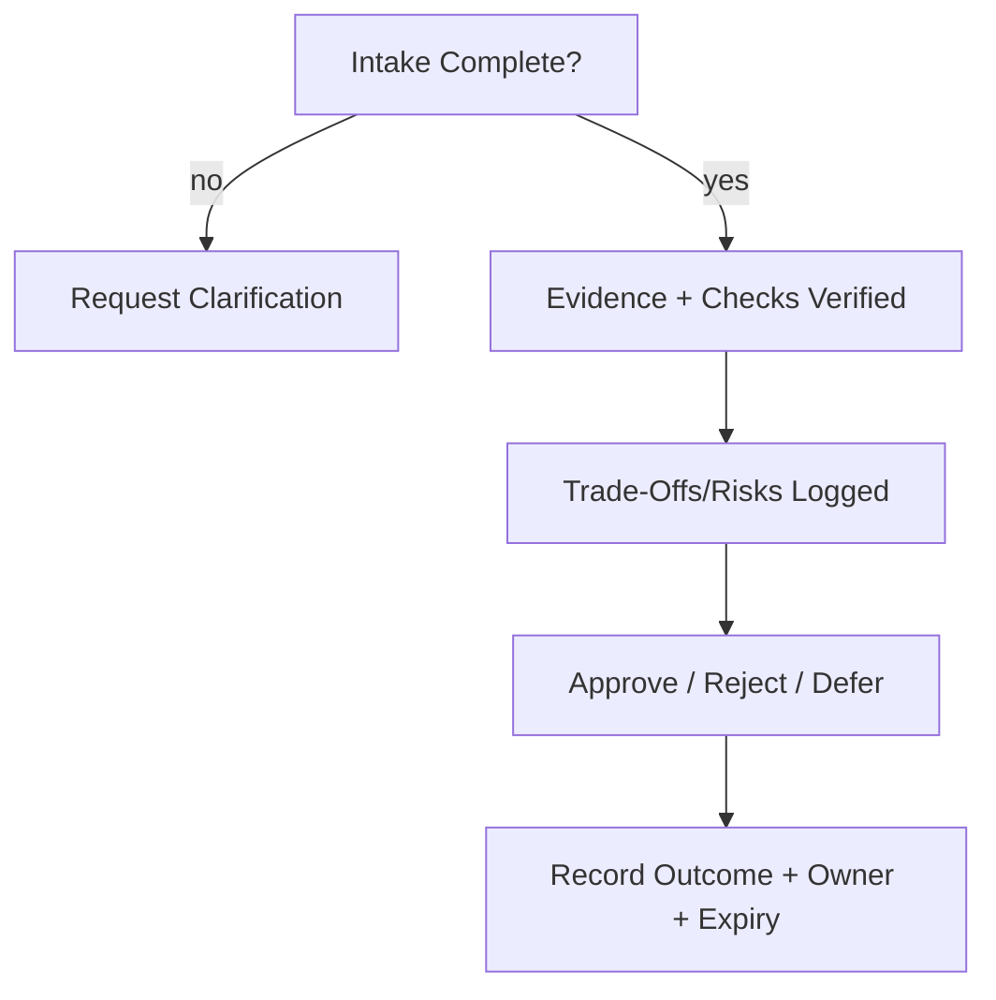

# Review — Process

Review is the **governed inspection** of specs, controls, skills, or system changes before acceptance.

It verifies evidence, checks, and alignment with declared scope and authority.

---

## Scope of Review

- New or updated specs/controls/skills
- Changes to authority models, boundaries, or lifetimes
- Introduction of new input channels, tools, or memory stores
- Deviations from prior acceptance scope

---

## Review Inputs

- Proposed change description and scope
- Evidence of validation and isolation status
- Trade-offs and risks, explicitly stated
- Check results (pass/fail with timestamps)
- Proposed owner and escalation paths

---

## Roles

- **Requester**: submits change and evidence
- **Reviewer**: examines evidence, requests clarifications
- **Approver**: can accept/reject; may be the same as reviewer if governance allows

Conflicts of interest must be declared; self-review is prohibited for high-risk scopes.

---

## Process Steps

1. Intake: verify completeness of submission.
2. Evidence check: confirm validation, isolation, and checks are present.
3. Risk/trade-off check: ensure costs are acknowledged and accepted by owner.
4. Decision: approve/reject/defer with rationale.
5. Record: archive decision, evidence links, owner, expiration.

---

## Outcomes

- **Approved**: moves to acceptance process.
- **Rejected**: remediations required.
- **Deferred**: pending additional evidence or clarification.

---

## Escalation

- Triggered when evidence is missing, conflicts arise, or scope/authority is disputed.
- Escalation target must be predefined (e.g., governance board, system owner).

---

## Status

This process is **stable**.  
Updates require governance approval and must preserve evidence and role separation.
