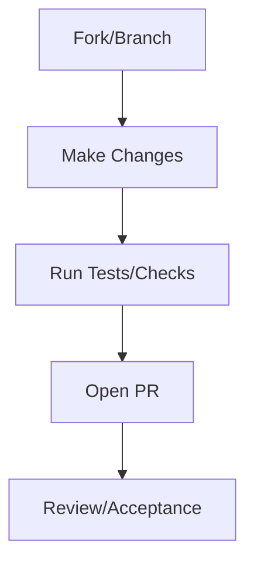

# Contributing

Thank you for your interest in contributing to this repository. We welcome contributions that align with our mission to make this knowledge accessible and beneficial to everyone.



## How You Can Contribute

### Reporting Bugs

If you find a bug, please report it by:

1. Checking the issue tracker to ensure it has not already been reported.
2. Providing a clear description, steps to reproduce, and any relevant logs or screenshots.

### Suggesting Enhancements

We welcome ideas to improve the project. Please submit an issue with:

- A detailed explanation of the enhancement.
- Why you believe it would be valuable.
- Any potential drawbacks or trade-offs.

### Contributing Real-World Experience: Failure Signals and Trade-offs

This repository thrives on practical insights. We particularly welcome contributions that document real-world experiences related to:

-   **Failure Signals:** Concrete observations, logs, or scenarios where context-engineered systems exhibited unexpected behavior, degradation, or outright failure. Detail the context, the observed symptoms, and if possible, the hypothesized root cause.
-   **Trade-offs:** Documented decisions where a specific control mechanism was chosen over others, detailing the benefits gained and the costs/downsides incurred (e.g., increased latency for improved isolation, reduced fluency for enhanced safety). Provide the problem context and the rationale for the chosen trade-off.

Please submit these as issues or pull requests, adhering to the canonical structure where applicable (e.g., adding to `01-failure-signals.md` or `02-trade-offs.md` for existing concepts, or proposing new ones). Your practical experience is invaluable for building a robust, evidence-based discipline.

### Example: Local Checks Before a PR

Run the lightweight checks in this order to catch regressions early:

```bash
make test          # fast pytest suite
make build         # mkdocs strict build to catch nav or content issues
make diagrams      # optional: render .mmd diagrams if you touched them
```

If you add or modify a concept example, follow the canonical structure (update the corresponding `03-examples.md` and reference at least one failure signal and one control trade-off) so the material stays actionable.

### Submitting Pull Requests

1. Fork the repository and create your branch from `main`.
2. Ensure that your changes adhere to the project's coding and documentation standards.
3. Write clear, concise commit messages.
4. Run tests locally before submitting.
5. Open a pull request with a detailed description of your changes and any related issues.

## Code of Conduct

By participating, you agree to uphold our [Code of Conduct](CODE_OF_CONDUCT.md).

## Questions?

If you have any questions, feel free to reach out via the issue tracker.
