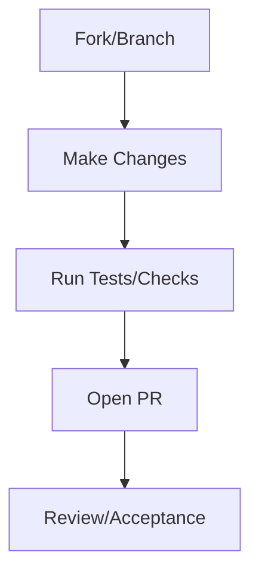

# Contributing

Thank you for your interest in contributing to this repository. We welcome contributions that align with our mission to make this knowledge accessible and beneficial to everyone.

## How You Can Contribute

### Reporting Bugs

If you find a bug, please report it by:

1. Checking the issue tracker to ensure it has not already been reported.
2. Providing a clear description, steps to reproduce, and any relevant logs or screenshots.

### Suggesting Enhancements

We welcome ideas to improve the project. Please submit an issue with:

- A detailed explanation of the enhancement.
- Why you believe it would be valuable.
- Any potential drawbacks or trade-offs.

### Submitting Pull Requests

1. Fork the repository and create your branch from `main`.
2. Ensure that your changes adhere to the project's coding and documentation standards.
3. Write clear, concise commit messages.
4. Run tests locally before submitting.
5. Open a pull request with a detailed description of your changes and any related issues.

## Code of Conduct

By participating, you agree to uphold our [Code of Conduct](CODE_OF_CONDUCT.md).

## Questions?

If you have any questions, feel free to reach out via the issue tracker.
