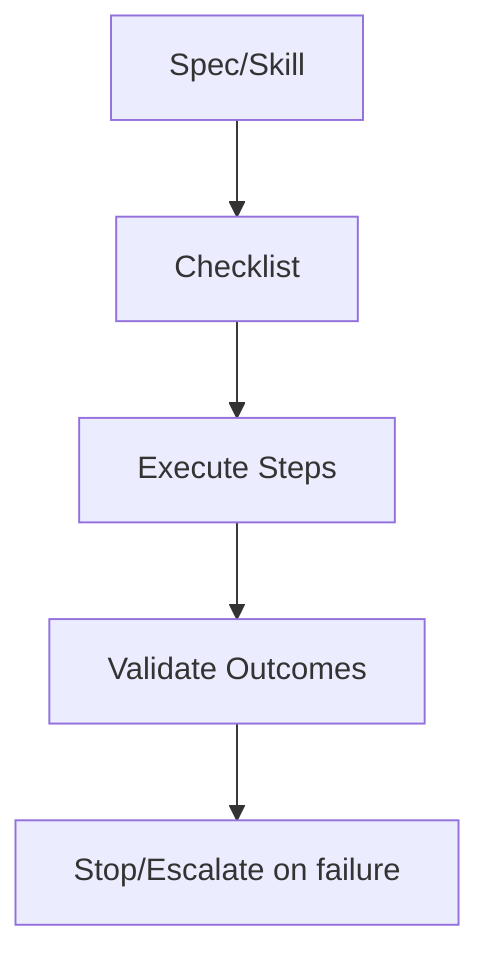

# Checklists — Index

Checklists are **execution aids** derived from specs and skills. They are not substitutes for the full documents; they enforce minimal steps, checks, and stop conditions.

Use the checklist that corresponds to the spec/skill you are executing. If a checklist conflicts with a spec, the spec prevails.
