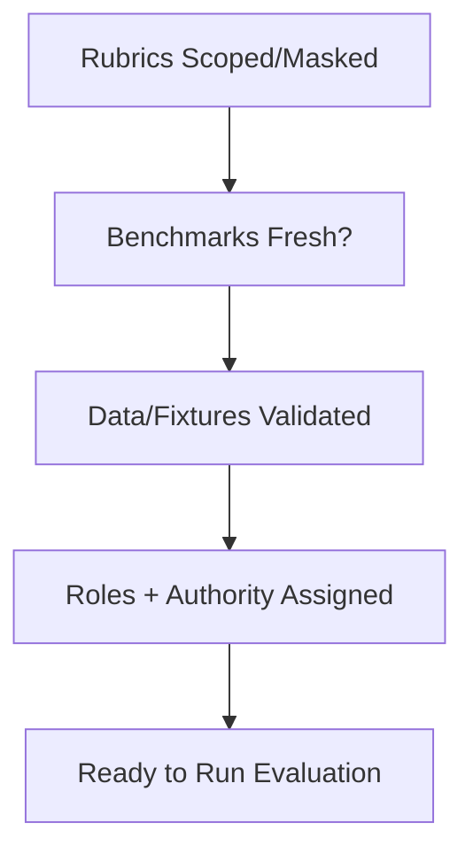

# Evaluation Readiness Checklist

## Steps

- [ ] Rubrics isolated from generation context.
- [ ] Benchmarks/fixtures current and scoped to task.
- [ ] Provenance recorded for all test data.
- [ ] Evaluation environment isolated from production.
- [ ] Success criteria and escalation paths defined.

## Escalate When

- Rubrics leak into generation.
- Benchmarks are stale or untrusted.
- Authority to accept results is unclear.
