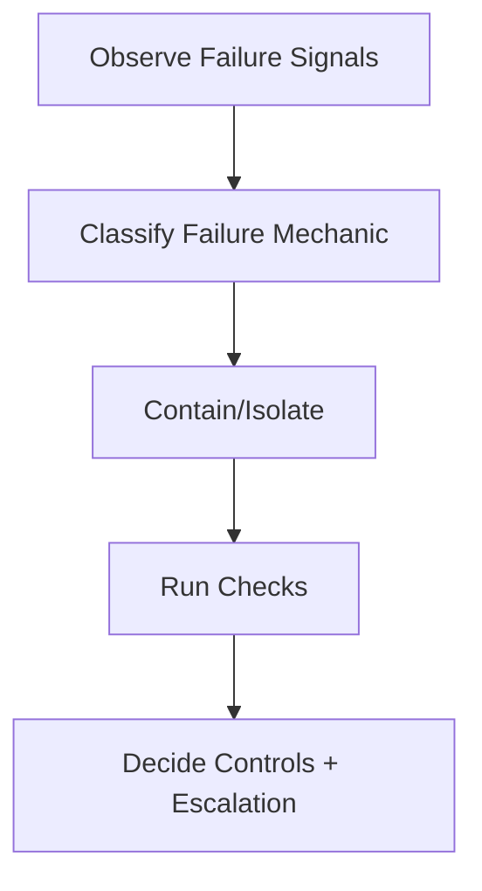

# Failure Triage Checklist

## Steps

- [ ] Collect failure signals and affected artifacts.
- [ ] Classify as degradation, drift, interference, or poisoning.
- [ ] Contain by masking/isolation before further action.
- [ ] Run relevant checks from the mapped mechanic.
- [ ] Decide remediation plan and owner.

## Escalate When

- Failure class cannot be determined.
- Containment requires authority change.
- Checks fail for safety/policy constraints.
