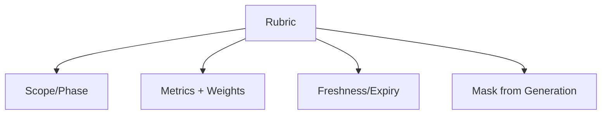

# Evaluation Rubric Contract

Defines the structure and governance for rubrics used in evaluation.

## Required Fields

- `name`, `version`, `owner`
- Scope (tasks, roles, phases where rubric applies)
- Criteria with scoring guidance and weights
- Expiration/review date and provenance for test data

## Governance Rules

- Rubrics must be masked from generation contexts.
- Changes require review/acceptance and version bump.
- Expired rubrics must be refreshed before reuse.
- Conflicts between rubric success and outcomes trigger escalation.
