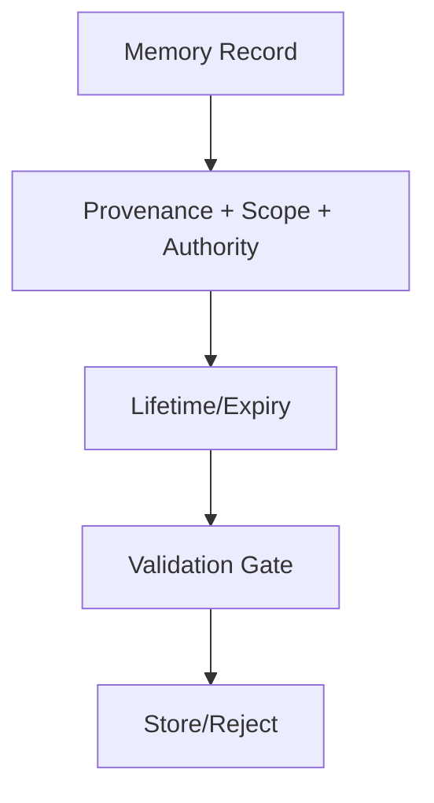

# Memory Record Contract

Defines the required fields and governance rules for any artifact persisted to memory.

## Required Fields

- `id`, `source`, `authority`, `scope`, `timestamp`
- `lifetime` (ephemeral/session/durable/persistent) with expiry timestamp
- `content` (text or structured data)
- `integrity` indicators (hash, signature if available)

## Governance Rules

- Validation on write and read; UNKNOWN provenance rejected.
- Promotion between lifetimes requires approval.
- Rollback path must exist for persistent entries.
- Access controlled by role/scope; auditing enabled.
