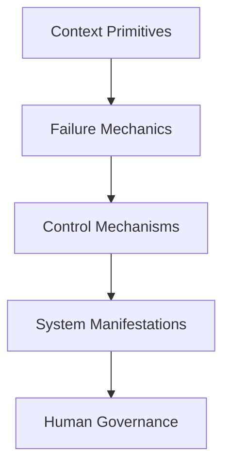
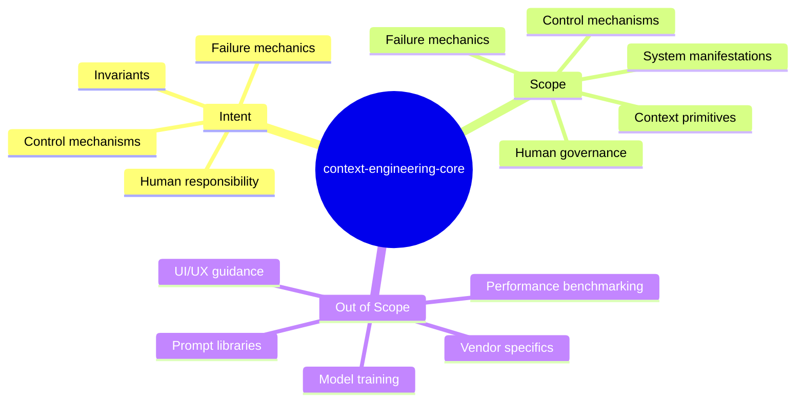

# Intent and Scope

This document defines the **intent**, **scope**, and **explicit boundaries** of the `context-engineering-core` repository.

It exists to prevent drift, ambiguity, and misinterpretation as the repository evolves.

---

## Intent

The intent of this repository is to define **context engineering as a discipline**, not as a collection of techniques.

Specifically, this repository exists to:

- Specify the **invariants** that govern context-dependent AI systems  
- Name the **failure mechanics** that predictably arise when those invariants are violated  
- Enumerate the **control mechanisms** available to designers, along with their costs  
- Make **human responsibility explicit** in systems that cannot be fully delegated  

The repository is designed for **design-time reasoning**, not runtime convenience.

It prioritizes:
- correctness over fluency
- clarity over speed
- responsibility over autonomy

---

## Scope

This repository covers **five layers**, in strict dependency order:

Each layer constrains the layers above it.

### Scope Mindmap

### In Scope

The repository explicitly includes:

- Attention as a constrained resource
- Signal, noise, scope, boundaries, and lifetimes
- Structural failure modes such as degradation, poisoning, interference, and drift
- Control mechanisms such as selection, ordering, masking, and compression
- System-level expressions including memory, tools, agents, and evaluation
- Human governance mechanisms including review, acceptance, escalation, and accountability

All included material must be:

- specifiable
- observable in real systems
- operationally actionable

---

## Out of Scope

This repository explicitly excludes:

- Prompt libraries or prompt optimization techniques
- Framework- or vendor-specific APIs
- Model training, fine-tuning, or NLP methods
- UI/UX guidance
- Performance benchmarking unrelated to context behavior
- Claims of optimality or universality

If a concept cannot be expressed independently of a specific tool, model, or vendor, it does not belong in this repository.

---

## Design Assumptions

This repository is built on the following assumptions:

1. **Context is bounded by attention, not tokens**
2. **Failure is structural, not accidental**
3. **Controls introduce trade-offs, not solutions**
4. **Human oversight is irreducible in non-trivial systems**

These assumptions are not debated within the repository.
They are treated as constraints.

---

## Execution Guarantee

Every concept defined in this repository must terminate in at least one of the following:

- a check
- a constraint
- a decision rule
- a diagnostic signal
- an executable pattern

Concepts that cannot be operationalized are considered incomplete and remain in `draft` status.

---

## Relationship to Adjacent Work

This repository defines **what must be true** for context engineering to work.

Operational frameworks, agent skill libraries, and tooling ecosystems define **how to act** within those constraints.

This repository is designed to precede and inform such work, not replace it.

---

## Non-Goals

This repository does not attempt to:

- reduce complexity
- guarantee ease of use
- abstract away failure
- eliminate the need for human judgment

Any system that claims alignment with this repository must accept these limits.

---

## References

- Vaswani et al., *Attention Is All You Need*, 2017
- Liu et al., *Lost in the Middle: How Language Models Use Long Contexts*, 2023
- Anthropic, *Constitutional AI*, 2022
- Microsoft, *Human-AI Interaction Guidelines*, 2020

These references inform the discipline but do not substitute for specification.

---

## Status

This document is **stable**.

Changes require explicit justification and must preserve the repository’s intent, scope, and execution guarantees.
