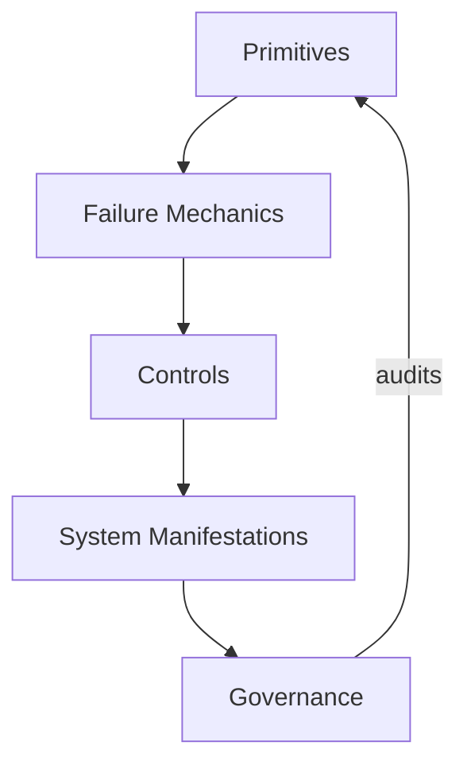

# Design Principles

These principles govern every artifact in `context-engineering-core`.
They exist to prevent drift, ambiguity, and accidental scope creep.

---

## 1) Spec-First

Every concept must be defined as a **specification** before examples, guidance, or tools.
Narrative without a spec is not accepted.

## 2) Discomfort-First

Surface risks, trade-offs, and failure modes explicitly.
If a design appears “easy,” it is under-specified.

## 3) Executable Orientation

Every idea must terminate in checks, controls, or decisions that can be run or audited.
Descriptive text without an execution path is incomplete.

## 4) Boundary Discipline

Authority, scope, lifetime, and channel boundaries must be explicit and enforceable.
Implicit boundaries are treated as failure risks.

## 5) Minimal Trust

Trust must be tiered and declared.
Untrusted or ambiguous inputs default to exclusion until validated.

## 6) Non-Overridable Governance

Human authority is explicit and cannot be overridden by agents or automation.
Escalation paths are mandatory where judgment is required.

## 7) Trade-Off Visibility

Every control or pattern must name what it sacrifices (throughput, autonomy, adaptability).
Hidden costs are treated as defects.

## 8) Layer Integrity

Primitives constrain failure mechanics; failure mechanics constrain controls; controls constrain manifestations; governance constrains everything.
Nothing may skip layers.

## 9) Deterministic Defaults

Default behaviors must be deterministic and documented.
Reliance on model “common sense” is treated as noise.

## 10) Reversibility

Wherever state persists, rollback must be possible.
Irreversible changes require explicit human approval.

---

## How to Apply These Principles

- Reject artifacts that do not declare boundaries, trade-offs, and checks.
- Prefer exclusion over inclusion when authority, scope, or lifetime are unclear.
- Require validation before any artifact is allowed to persist or propagate.
- Escalate when a principle cannot be satisfied rather than weakening it silently.

---

## Status

These principles are **stable**.
Changes require explicit justification and must not weaken executable integrity.
