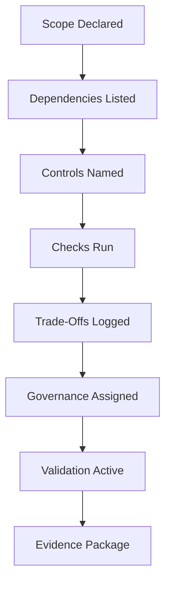

# Conformance

This document defines what it means to claim conformance with `context-engineering-core`.

Conformance is **not binary** and **not self-attested**.
It is a governed claim that must be supported by evidence.

---

## Scope of Conformance

Conformance applies to:

- Specifications and patterns published from this repository
- Implementations that assert alignment with these specs
- Skills, gates, and orchestration logic derived from the controls layer

Conformance does **not** apply to:

- General model behavior
- Vendor-specific features
- Unvalidated extensions

---

## Minimum Conformance Criteria

An artifact may claim conformance only if **all** are true:

1. **Scope Declared** — The artifact states which layers and concepts it aligns to.
2. **Dependencies Declared** — Upstream primitives and failure mechanics are listed.
3. **Controls Named** — Controls used (selection, ordering, masking, compression, validation, isolation) are explicit.
4. **Checks Present** — Executable checks exist and are runnable without interpretation.
5. **Trade-Offs Exposed** — Costs and limits are documented and accepted.
6. **Governance Assigned** — Ownership, escalation, and authority are defined.
7. **Validation Active** — Persistent artifacts are revalidated per `30-control-mechanisms/validation`.

If any criterion is missing, the claim is **non-conformant**.

---

## Evidence Requirements

Conformance claims must include:

- References to the relevant specs by path (e.g., `10-primitives/scope/00-spec.md`)
- Check results or test artifacts showing controls and checks executed
- Decision records for trade-offs and boundary choices
- Escalation/approval records where human authority was required

Lack of evidence invalidates the claim.

---

## Levels of Conformance

- **Aligned**: Meets all minimum criteria with evidence for core controls and checks.
- **Partial**: Meets some criteria; gaps are listed with remediation plan and owner.
- **Non-Conformant**: Does not meet minimum criteria or lacks evidence.

Use these levels when reporting status; do not invent additional levels.

---

## Non-Claims

Conformance does not claim:

- Optimality or performance
- Safety beyond declared controls and checks
- Portability across vendors or models
- Completeness beyond documented scope

---

## How to Assess Conformance

1. Identify scope and dependencies.
2. Verify controls are implemented as specified.
3. Run the documented checks; record outcomes.
4. Inspect trade-offs and approvals.
5. Confirm validation and isolation are in force where required.
6. Assign a conformance level (Aligned, Partial, Non-Conformant) with evidence.

Escalate if any step cannot be completed.

---

## Status

This document is **stable**.
Updates require justification and must not weaken the evidence burden for conformance claims.
