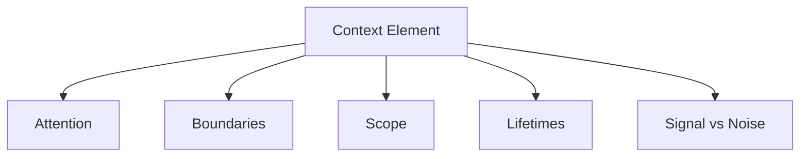

# How Primitives Compose

This document explains how the primitives defined in this repository **interact structurally** and why higher-level control mechanisms exist.

This is not a guide.  
It is a **composition contract**.

Controls do not replace primitives.  
Controls exist because primitives impose constraints.

---

## Composition Is Not Addition

Primitives do not stack linearly.

They **intersect**.

Each primitive constrains a different axis of influence:

| Primitive | Governs |
|---------|--------|
| Attention | Capacity |
| Boundaries | Influence paths |
| Scope | Applicability |
| Lifetimes | Temporal validity |
| Signal vs Noise | Attention allocation |

A system fails when any axis is ignored, even if others are well-specified.

---

## The Composition Surface

Every context element entering a system is simultaneously subject to **all primitives**.

If a context element bypasses any one of these, the system is underspecified.

---

## Why Controls Exist

Controls exist because primitives **do not act on their own**.

Primitives describe constraints.  
Controls enforce them.

| Primitive Pressure     | Resulting Control Class |
| ---------------------- | ----------------------- |
| Attention is limited   | Compression, Ordering   |
| Boundaries must hold   | Isolation, Trust        |
| Scope must be enforced | Masking, Routing        |
| Lifetimes must expire  | Validation, Promotion   |
| Noise must be reduced  | Selection, Filtering    |

Controls are *responses* to primitive pressure.

---

## Composition Failure Patterns

Most real failures come from **partial composition**.

Examples:

- Attention + no signal discrimination → degradation
- Boundaries + no scope → interference
- Scope + no lifetimes → drift
- Lifetimes + no validation → poisoning
- Signal selection + no boundaries → brittle systems

Primitives must compose **together**, not selectively.

---

## Control Design Constraint

A valid control must satisfy all of the following:

1. It does not redefine a primitive.
2. It enforces at least one primitive explicitly.
3. It does not bypass another primitive.
4. It makes its trade-offs visible.

Any control violating these rules is misdesigned.

---

## What This Repository Enforces

This repository enforces the following invariant:

> No control may exist without an explicit primitive justification.

If a mechanism cannot be traced back to:

- attention pressure
- boundary enforcement
- scope restriction
- lifetime governance
- signal discrimination

…it does not belong here.

---

## Reader Guidance

If you are:

- **Designing systems** → read primitives first, then controls
- **Debugging failures** → map symptoms to primitives before tools
- **Adding controls** → justify them via primitive composition

Skipping primitives guarantees accidental complexity.

---

## Status

This document is **stable**.

It is the canonical bridge between primitives and control mechanisms.
