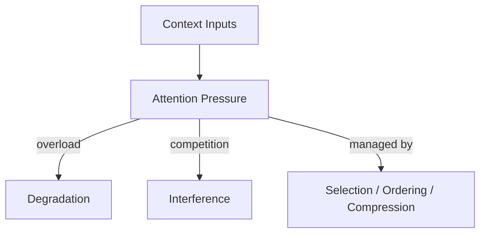

# Attention

This specification defines **attention** as the hard capacity constraint in context-engineered systems.

Attention is the **limiting resource** that governs how much context can influence behavior.  
Tokens are an approximation; usable attention is the constraint.

Without explicit attention management, context accumulation produces degradation and interference.

---

## Definition

**Attention** is the finite cognitive budget a model allocates to contextual signals when producing an output.

Properties:
- **Bounded**: cannot be expanded by adding more tokens
- **Competitive**: signals compete for salience
- **Order-sensitive**: position and recency bias allocation
- **Non-linear**: overload causes collapse, not graceful decay

---

## Why Attention Is Primitive

- All controls ultimately arbitrate attention (selection, ordering, compression).
- Failure mechanics (degradation, interference) are attention-mediated.
- Primitives that ignore attention become aspirational, not operational.

---

## Attention vs Context Size

- Large context windows do **not** imply large attention.
- Adding tokens can reduce effective attention to high-signal constraints.
- Attention must be **budgeted**, not assumed.

---

## Attention Pressure Sources

- Long message histories
- Redundant retrievals
- Verbose tool outputs
- Parallel tasks or roles
- Unscoped policies or rubrics

---

## Quick Example (Execution)

**Situation**: Long-running chat (200 turns) with verbose tool logs and retrievals; safety constraint appears once near the top.  
**Failure**: Safety constraint intermittently ignored as logs and retrievals dominate attention.  
**Intervention**: Keep last N turns verbatim, compress older turns, mask tool logs to result/status/error, and pin the safety constraint first.  
**Result**: Constraint is consistently honored; attention utilization drops below budget and responses stabilize.

---

## Execution Path (quick)

- **Inputs**: declared attention budget; context assembly (history, retrievals, tool outputs); constraint list with authority.
- **Steps**: estimate token/attention load; pin constraints first; cap retrieval/tool budgets; compress/dedupe history; mask noisy fields.
- **Checks**: budget < target; constraints present and earliest; weak signals not displaced; noisy channels masked.
- **Stop/escate**: budget unknown; constraint would be dropped/compressed; provenance missing for pinned items.

---

## Attention Invariants

- Increasing context without arbitration **reduces** effective attention.
- Weak but critical signals are the first to be displaced.
- Overload causes non-linear failure (sudden collapse, not gradual fade).

---

## Design Implications

- Declare an explicit attention budget per task.
- Bias toward exclusion when salience is uncertain.
- Elevate constraints before background.
- Measure utilization; do not guess.

---

## Non-Claims

This specification does not claim:
- A universal token-to-attention ratio
- That attention can be fully predicted per model
- That larger windows improve outcomes
- That attention can be “optimized away”

It defines the constraint, not its vendor-specific behavior.

---

## Status

This specification is **stable**.  
Changes require explicit justification and must not weaken the primacy of attention as a binding constraint.
