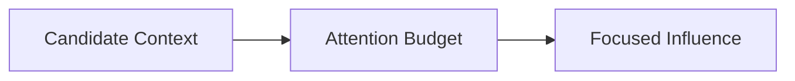

# Attention — Trade-Offs

This document enumerates the **structural trade-offs** introduced when enforcing attention constraints.

Attention management does not improve capability.  
It **limits influence** to keep behavior stable.

---

## Core Trade-Off

Attention control trades **coverage** for **stability**.

You cannot keep everything. Exclusion is required.

---

## Aggressive Budgeting

**Improves**
- reduces overload risk
- preserves constraint visibility
- simplifies reasoning

**Costs**
- higher omission risk (weak signals lost)
- more orchestration effort
- user-perceived brittleness

---

## Permissive Budgeting

**Improves**
- tolerance for ambiguity
- flexibility during exploration

**Costs**
- degradation under load
- positional/recency bias dominates
- hidden attention failures

---

## Constraint Elevation

**Improves**
- safety and policy salience
- invariants remain visible

**Costs**
- reduced adaptability
- potential suppression of useful background

---

## Depth vs Breadth

**Depth (few items, more detail)**
- preserves nuance
- better for single-task focus
- higher overload risk from verbose items

**Breadth (more items, less detail)**
- better coverage
- lower per-item weight
- risk of losing nuance/edge cases

---

## Interaction with Other Controls

- **Selection**: decides eligibility before attention is spent.
- **Ordering**: mitigates positional bias; may still suppress late items.
- **Compression**: reduces volume; risks distortion.
- **Masking**: confines attention to scope; over-masking can hide needed signal.

Attention failures often originate upstream; controls must coordinate.

---

## Governance Trade-Offs

As attention control tightens:
- human judgment about what to exclude becomes critical
- disagreements about “what matters” surface
- automation must defer to declared authority

---

## Invariants

- More context is not more signal.
- Weak signals need explicit elevation or they are lost.
- Attention overload is non-linear; small additions can cause collapse.
- Defaults must favor exclusion when uncertain.

Any design claiming to keep “everything” is mis-specified.

---

## Status

This document is **stable**.  
Trade-offs must be stated before applying any attention-management control.
