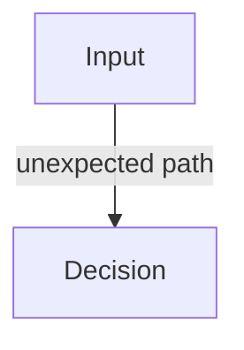

# Boundaries — Failure Signals

This document enumerates **observable signals** that indicate boundary violations or boundary erosion.

Boundary failure signals describe **where influence flows incorrectly**, not whether outputs are good or bad.  
They are structural indicators that precede degradation, drift, interference, or poisoning.

---

## Signal Model

Boundary failures surface as **unexpected influence paths**.

If an input affects a decision **outside its declared boundary**, a boundary failure exists.

---

## Authority Boundary Signals

### Accidental Override

Observed behaviors:

- lower-trust inputs negate higher-authority rules
- retrieved text weakens system instructions
- user phrasing reframes policy

Interpretation:

- authority hierarchy is missing or unenforced
- precedence inferred from position or verbosity

Primary downstream risks:

- interference
- poisoning

---

### Authority Ambiguity

Observed behaviors:

- different runs follow different sources
- no single source is consistently obeyed
- conflicts resolved implicitly

Interpretation:

- authority is not declared
- arbitration is accidental

---

## Scope Boundary Signals

### Instruction Bleed

Observed behaviors:

- task-specific instructions affect unrelated tasks
- one agent’s role leaks into another’s behavior
- setup instructions persist beyond their phase

Interpretation:

- scope is global by default
- boundaries between tasks or roles are missing

Primary downstream risks:

- interference
- coordination collapse

---

### Role Collapse

Observed behaviors:

- assistant alternates roles mid-response
- safety, policy, and execution blend
- no clear responsibility separation

Interpretation:

- scope boundaries between roles are weak
- influence is not compartmentalized

---

## Temporal Boundary Signals

### Stale Context Persistence

Observed behaviors:

- outdated assumptions continue to guide decisions
- corrections do not fully replace earlier context
- behavior reflects past states rather than current input

Interpretation:

- temporal expiration not enforced
- intent is treated as timeless

Primary downstream risks:

- drift

---

### Irreversible Influence

Observed behaviors:

- one interaction permanently alters behavior
- system resists correction
- past input dominates future decisions

Interpretation:

- temporal and persistence boundaries collapsed
- no decay or reset mechanism

---

## Persistence Boundary Signals

### Unvetted Memory Promotion

Observed behaviors:

- single inputs written directly to long-term memory
- summaries absorb unverified claims
- memory changes without review

Interpretation:

- persistence boundary missing
- validation bypassed

Primary downstream risks:

- poisoning

---

### Memory Shadowing

Observed behaviors:

- memory entries override fresh input
- incorrect memories recur despite contradiction
- source of memory unclear

Interpretation:

- persistence outranks authority incorrectly
- rollback impossible

---

## Channel Boundary Signals

### Instruction-as-Data

Observed behaviors:

- data fields contain imperatives
- examples change behavior beyond illustration
- logs or docs issue constraints

Interpretation:

- channel separation violated
- instruction smuggled through data

Primary downstream risks:

- poisoning

---

### Feedback-as-Policy

Observed behaviors:

- user ratings redefine success criteria
- feedback alters constraints
- learning loops overwrite intent

Interpretation:

- feedback channel treated as authoritative
- governance bypassed

---

## Cross-Boundary Signals

### Influence Without Attribution

Observed behaviors:

- system cannot explain why a decision occurred
- no trace of influencing inputs
- provenance unavailable

Interpretation:

- boundaries exist implicitly, not structurally
- audit impossible

---

### Boundary Drift

Observed behaviors:

- boundaries weaken over time
- exceptions accumulate
- enforcement becomes inconsistent

Interpretation:

- boundary governance missing
- erosion mistaken for flexibility

---

## Distinguishing Boundary Failure from Outcome Failure

| Observation                  | Boundary Failure? |
| ---------------------------- | ----------------- |
| Wrong answer                 | Not necessarily   |
| Confident but wrong          | Possibly          |
| Unexpected influence         | Yes               |
| Correct output, wrong source | Yes               |

Boundary failures are about **process integrity**, not correctness.

---

## Detection Guidance

Boundary failures are detected by:

- tracing influence paths
- reordering context sources
- isolating inputs experimentally
- auditing persistence writes
- inspecting provenance

Output evaluation alone is insufficient.

---

## When to Escalate

Escalation is required when:

- influence paths are unclear
- authority conflicts recur
- persistence cannot be rolled back
- channel violations are observed

Boundary violations compound rapidly.

---

## Status

This document is **stable**.

Signals listed here are sufficient to detect boundary failures before they manifest as higher-order system failures.
