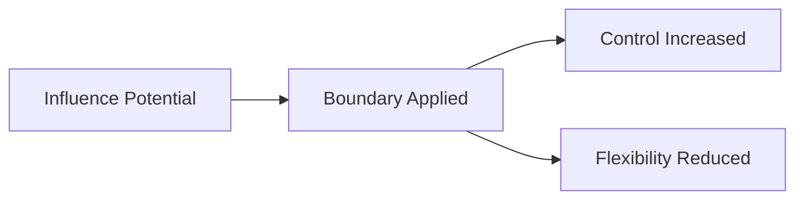
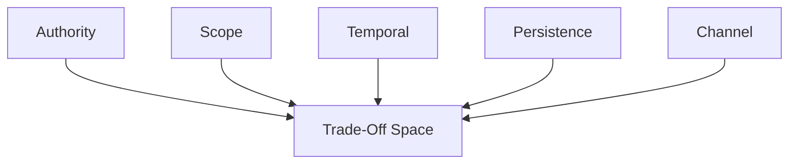

# Boundaries — Trade-Offs

This document enumerates the **structural trade-offs introduced by enforcing boundaries** in context-engineered systems.

Boundaries do not optimize behavior.  
They **reduce freedom of influence** to preserve system integrity.

Every boundary is a deliberate loss of flexibility.

---

## Trade-Off Model

Boundaries trade **reach** for **control**.

Systems that deny this trade-off externalize failure instead of preventing it.

---

## Authority Boundary Trade-Offs

**What authority boundaries improve**

- predictable decision-making
- resistance to override
- protection against poisoning and interference

**What they constrain**

- dynamic reinterpretation
- local optimization
- emergent coordination

**Structural cost**

- authority mistakes are amplified
- misassigned authority is hard to correct

**Failure mode if ignored**

- accidental overrides
- silent policy erosion

Authority boundaries prevent chaos by enforcing hierarchy.

---

## Scope Boundary Trade-Offs

**What scope boundaries improve**

- task isolation
- role clarity
- reduced interference

**What they constrain**

- reuse of context
- cross-task generalization
- shared reasoning

**Structural cost**

- duplicated context
- coordination overhead

**Failure mode if ignored**

- instruction bleed
- role collapse

Scope boundaries localize influence by sacrificing reuse.

---

## Temporal Boundary Trade-Offs

**What temporal boundaries improve**

- freshness of intent
- resistance to drift
- correction effectiveness

**What they constrain**

- continuity
- long-term accumulation
- persistent optimization

**Structural cost**

- frequent revalidation
- state invalidation

**Failure mode if ignored**

- stale context persistence
- misaligned behavior

Temporal boundaries enforce relevance by limiting memory.

---

## Persistence Boundary Trade-Offs

**What persistence boundaries improve**

- integrity of memory
- rollback capability
- resistance to poisoning

**What they constrain**

- learning speed
- adaptability
- convenience

**Structural cost**

- validation overhead
- delayed reinforcement

**Failure mode if ignored**

- permanent corruption
- self-reinforcing errors

Persistence boundaries protect the future by slowing the present.

---

## Channel Boundary Trade-Offs

**What channel boundaries improve**

- semantic clarity
- trust separation
- auditability

**What they constrain**

- expressiveness
- natural blending of signals
- informal workflows

**Structural cost**

- additional parsing
- stricter schemas

**Failure mode if ignored**

- instruction smuggling
- trust collapse

Channel boundaries prevent category errors at the cost of fluidity.

---

## Cross-Boundary Trade-Offs

Boundaries compound.

Common compound costs:

- increased orchestration complexity
- higher governance burden
- reduced autonomy
- slower iteration

These costs are structural, not accidental.

---

## Boundary Invariants

The following always hold:

- More boundaries reduce emergent behavior.
- Fewer boundaries increase failure blast radius.
- Boundaries shift responsibility to designers.
- Boundaries require enforcement to matter.

Any design denying these is incomplete.

---

## Trade-Off Visibility Requirement

Boundary trade-offs must be visible and intentional.

Acceptable mechanisms:

- boundary declarations
- scope diagrams
- authority hierarchies
- expiration policies
- rollback procedures

Hidden boundaries become hidden failures.

---

## Relationship to Governance

Boundaries are governance instruments.

As boundary strength increases:

- automation decreases
- human responsibility increases
- decision rights become explicit

Boundaries do not remove accountability.
They concentrate it.

---

## Status

This document is **stable**.

Trade-offs listed here are sufficient to reason about boundary enforcement decisions at the primitive level.
