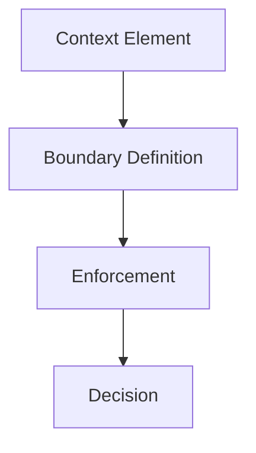

# Boundaries — Checks

This document defines **executable structural checks** to verify that boundaries are explicit, enforced, and govern influence flow correctly.

Boundary checks are **process-integrity checks**, not output-quality checks.  
A system may produce correct outputs while still failing every boundary check.

---

## Check Model

Boundary checks validate whether **influence paths are intentional**.

If a context element reaches a decision **without passing through a defined boundary**, the system is mis-specified.

---

## Check 1: Authority Declaration

**Question**  
Is the authority of every context element explicitly declared?

**How to run**

- Enumerate all context sources (system, policy, tool, retrieval, user, memory, feedback).
- Identify which sources can override others.

**Pass criteria**

- Authority hierarchy is explicit and documented.
- Lower-authority inputs cannot override higher-authority ones.

**Fail indicators**

- “All inputs are treated equally”
- Authority inferred from order or verbosity
- Conflicts resolved implicitly

**Associated failures**

- Interference
- Poisoning

---

## Check 2: Scope Definition

**Question**  
Is the scope of each context element explicitly bounded?

**How to run**

- Identify tasks, roles, phases, and agents.
- Verify which context applies to each.

**Pass criteria**

- Scope is declared per task, role, or phase.
- Context does not bleed across scopes.

**Fail indicators**

- Global instructions by default
- Role confusion
- Task setup affecting unrelated behavior

**Associated failures**

- Interference

---

## Check 3: Temporal Expiration

**Question**  
Do context elements have explicit temporal limits?

**How to run**

- Inspect instructions, assumptions, and policies.
- Verify expiration, refresh, or revalidation rules.

**Pass criteria**

- Time-bound or execution-bound influence is enforced.
- Stale context is removed deterministically.

**Fail indicators**

- Instructions treated as permanent
- Corrections that do not fully replace prior state

**Associated failures**

- Drift

---

## Check 4: Persistence Gating

**Question**  
Is persistence explicitly gated and reversible?

**How to run**

- Trace how inputs enter long-term memory or learning loops.
- Verify validation and rollback mechanisms.

**Pass criteria**

- Persistence requires validation.
- State changes can be undone.

**Fail indicators**

- Immediate memory writes
- Irreversible summaries
- No rollback path

**Associated failures**

- Poisoning

---

## Check 5: Channel Separation

**Question**  
Are instruction, data, feedback, and policy separated by channel?

**How to run**

- Inspect schemas, prompts, and pipelines.
- Identify whether channels are conflated.

**Pass criteria**

- Each channel has defined semantics.
- Cross-channel influence is intentional and governed.

**Fail indicators**

- Data issuing instructions
- Feedback redefining policy
- Logs altering constraints

**Associated failures**

- Poisoning
- Interference

---

## Check 6: Influence Traceability

**Question**  
Can every decision be traced back to its influencing context elements?

**How to run**

- Select a decision.
- Enumerate all context elements that influenced it.

**Pass criteria**

- Influence paths are enumerable.
- Sources are attributable.

**Fail indicators**

- “We don’t know why this happened”
- No provenance or lineage
- Implicit influence

**Associated failures**

- All failure mechanics

---

## Minimal Boundary Audit (Checklist)

A system minimally conforms if all are true:

- [ ] Authority hierarchy is explicit
- [ ] Scope is bounded per task/role
- [ ] Temporal limits exist
- [ ] Persistence is gated and reversible
- [ ] Channels are separated
- [ ] Influence is traceable

Failure of any item indicates boundary failure.

---

## When to Re-run These Checks

Re-run boundary checks when:

- new context sources are added
- tasks or roles expand
- memory or learning is introduced
- policies change
- unexplained failures appear

Boundary failures compound silently.

---

## Status

This document is **stable**.

Checks listed here are sufficient to validate boundaries as a foundational primitive governing influence flow.
