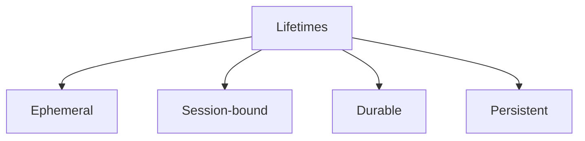
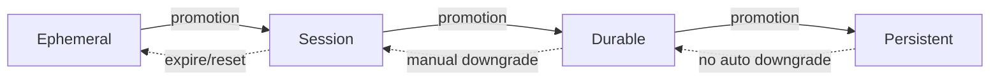
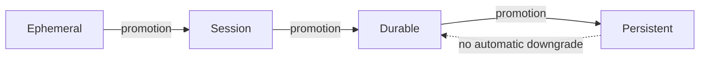

# Lifetimes

This specification defines **lifetimes** as a foundational primitive in context-engineered systems.

Lifetimes determine **how long a context element remains valid, influential, or eligible for reuse**.

If scope answers *where* context applies, lifetimes answer *for how long* it should apply.

---

## Definition

A **lifetime** is the explicit temporal validity of a context element.

It defines:
- when an element becomes active
- when it expires
- whether it may persist
- whether it may be renewed

Lifetimes govern **temporal authority**, not priority.

---

## Why Lifetimes Are Primitive

Lifetimes are primitive because:

- context does not decay automatically
- models do not forget intentionally
- stale assumptions remain influential
- correction does not overwrite by default

Every system has lifetimes.  
Most systems fail because they are implicit.

---

## Lifetime vs Scope

These are related but distinct.

- **Scope** limits applicability domains.
- **Lifetimes** limit temporal validity.

An instruction may be:
- correctly scoped
- but temporally invalid

Temporal errors are not scope errors.

---

## Lifetime Classes

Context elements fall into distinct lifetime classes.

Each class introduces different risks.

---

## Ephemeral Lifetime

Ephemeral context:

- applies immediately
- expires after use
- leaves no residue

Typical examples:

- single-step instructions
- transient clarifications
- one-off constraints

Failure risk if misused:

- minimal individually
- high when accidentally persisted

---

## Session-Bound Lifetime

Session-bound context:

- applies for the duration of an interaction
- expires at session termination

Typical examples:

- user preferences
- conversational tone
- task framing

Failure risk if misused:

- drift across sessions
- unintended carryover

---

## Quick Example (Execution)

**Situation**: Yesterday’s conversation summary is reused in a new session without validation or expiry.  
**Failure**: Outdated assumptions persist and drive incorrect answers; drift accumulates.  
**Intervention**: Mark summaries as session-bound with a 1-session TTL, require validation before renewal, and drop on task change.  
**Result**: Stale summaries are discarded or refreshed; responses reflect current context only.

---

## Durable Lifetime

Durable context:

- spans multiple sessions
- requires justification to persist
- may be revoked

Typical examples:

- learned heuristics
- calibrated behaviors
- trusted patterns

Failure risk if misused:

- slow drift
- partial poisoning

---

## Persistent Lifetime

Persistent context:

- remains until explicitly removed
- survives resets
- affects all future behavior

Typical examples:

- long-term memory
- policy rules
- system constraints

Failure risk if misused:

- permanent poisoning
- irreversible misalignment

Persistent context is a governance decision.

---

## Lifetime Transitions

Context elements may move between lifetime classes.

Promotion must be explicit.  
Downgrade must be intentional.

---

## Lifetime Failure Patterns

Common lifetime failures include:

- treating ephemeral input as persistent
- failing to expire session assumptions
- promoting without validation
- lacking downgrade paths

These failures directly produce:

- **drift** (stale context)
- **poisoning** (corrupted persistence)

---

## Design Implications

From a system design perspective:

- every context element must declare a lifetime
- default lifetime should be short
- promotion requires justification
- expiration must be enforceable
- rollback must be possible

Time is not neutral.  
It is a control surface.

---

## Non-Claims

This specification does not claim:

- that longer lifetimes are better
- that learning requires persistence
- that lifetimes can be inferred reliably
- that expiration guarantees correctness

It defines temporal validity, not intelligence.

---

## Status

This specification is **stable**.

It provides sufficient grounding to define lifetime failure signals, trade-offs, examples, and enforcement checks.
