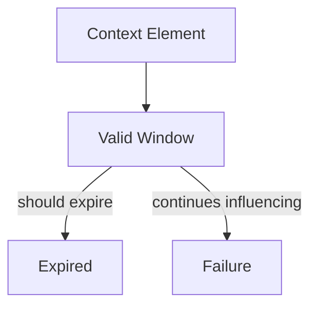

# Lifetimes — Failure Signals

This document enumerates **observable signals** that indicate lifetime mis-specification, erosion, or absence.

Lifetime failures are **temporal integrity failures**.  
They occur when context remains influential longer than intended, or expires without replacement.

---

## Signal Model

Lifetime failures surface when **temporal validity is violated**.

If expired context continues to influence decisions, a lifetime failure exists.

---

## Ephemeral Lifetime Failure Signals

### Accidental Persistence

Observed behaviors:

- one-off instructions reappear later
- transient constraints recur
- clarifications influence future tasks

Interpretation:

- ephemeral inputs promoted implicitly
- persistence boundary violated

Primary downstream failures:

- poisoning (if persisted)
- interference (if reused)

---

### Residual Influence

Observed behaviors:

- outputs reflect prior single-step guidance
- corrections partially applied
- system “remembers” momentary intent

Interpretation:

- cleanup not enforced
- ephemeral lifetime treated as session-bound

---

## Session-Bound Lifetime Failure Signals

### Session Bleed

Observed behaviors:

- preferences carry across sessions
- conversational tone persists unexpectedly
- assumptions survive resets

Interpretation:

- session boundary missing or weak
- session-bound context treated as durable

Primary downstream failures:

- drift

---

### Inconsistent Reset Behavior

Observed behaviors:

- some sessions reset state, others do not
- identical inputs produce different outcomes after restart

Interpretation:

- non-deterministic lifetime enforcement
- implicit caching

---

## Durable Lifetime Failure Signals

### Silent Accretion

Observed behaviors:

- behavior slowly changes over time
- no single change explains shift
- adjustments accumulate without review

Interpretation:

- durable context promoted without governance
- no review or decay mechanism

Primary downstream failures:

- drift

---

### Partial Correction Resistance

Observed behaviors:

- corrections reduce but do not eliminate behavior
- old assumptions coexist with new ones

Interpretation:

- durable context not replaced atomically
- downgrade path missing

---

## Persistent Lifetime Failure Signals

### Irreversible State

Observed behaviors:

- behavior cannot be corrected
- resets do not remove influence
- system resists change

Interpretation:

- persistent context lacks rollback
- governance absent

Primary downstream failures:

- poisoning

---

### Global Contamination

Observed behaviors:

- a single event affects all future behavior
- unrelated tasks reflect the same bias

Interpretation:

- persistent lifetime applied too broadly
- promotion without validation

---

## Lifetime Transition Failure Signals

### Unauthorized Promotion

Observed behaviors:

- context moves to longer lifetime without review
- single interaction causes lasting change

Interpretation:

- promotion rules absent
- validation bypassed

Primary downstream failures:

- poisoning
- drift

---

### Stuck Lifetimes

Observed behaviors:

- context cannot be downgraded
- expiration rules ignored

Interpretation:

- downgrade paths undefined
- temporal authority missing

---

## Distinguishing Lifetime Failure from Other Failures

| Observation                  | Lifetime Failure?   |
| ---------------------------- | ------------------- |
| Wrong answer                 | Not necessarily     |
| Behavior changes over time   | Possibly            |
| One input has lasting effect | Yes                 |
| Correction fails to stick    | Yes                 |
| Conflicting inputs           | No (Scope/Boundary) |

Lifetime failures are about **temporal misapplication**, not applicability or authority.

---

## Detection Guidance

Lifetime failures are detected by:

- replaying identical inputs over time
- resetting sessions and comparing outputs
- forcing expiration manually
- auditing promotion paths

Static evaluation is insufficient.

---

## When to Escalate

Escalation is required when:

- corrections do not fully apply
- persistent influence cannot be removed
- behavior drifts without traceable cause

Lifetime failures compound silently and are costly to reverse.

---

## Status

This document is **stable**.

Signals listed here are sufficient to detect lifetime failures before they manifest as systemic drift or poisoning.
