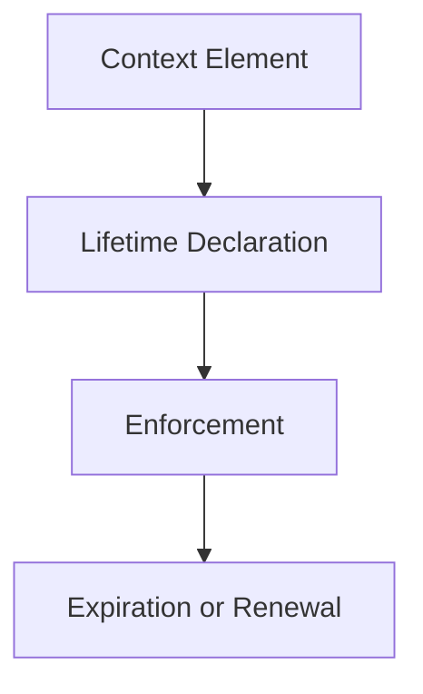

# Lifetimes — Checks

This document defines **executable temporal checks** to verify that context lifetimes are explicit, enforced, and govern influence duration correctly.

Lifetime checks validate **how long context is allowed to influence behavior**, not whether that influence is correct.

A system may behave coherently while failing every lifetime check.

---

## Check Model

Lifetime checks verify that **temporal validity is explicit and enforceable**.

If a context element continues influencing behavior after its declared expiration, a lifetime failure exists.

---

## Check 1: Lifetime Declaration

**Question**  
Does every context element declare an explicit lifetime?

**How to run**

- Enumerate all context elements (instructions, preferences, memory writes, heuristics).
- Identify declared lifetimes for each.

**Pass criteria**

- Lifetime class is explicit (ephemeral, session-bound, durable, persistent).
- Default lifetime is not implicit persistence.

**Fail indicators**

- “It just stays unless removed”
- Undeclared temporal validity
- Reliance on model forgetting

**Associated failures**

- Drift
- Poisoning

---

## Check 2: Expiration Enforcement

**Question**  
Are expired context elements deterministically removed or ignored?

**How to run**

- Force expiration conditions.
- Observe whether influence persists.

**Pass criteria**

- Expired elements have zero influence.
- Cleanup is deterministic.

**Fail indicators**

- Partial expiration
- Residual influence
- Manual cleanup required

**Associated failures**

- Drift

---

## Check 3: Session Boundary Reset

**Question**  
Does session-bound context reliably reset at session termination?

**How to run**

- End and restart sessions.
- Compare outputs for identical inputs.

**Pass criteria**

- Session-bound context does not carry over.
- Reset behavior is consistent.

**Fail indicators**

- Session bleed
- Inconsistent resets

**Associated failures**

- Drift

---

## Check 4: Promotion Governance

**Question**  
Are lifetime promotions explicit and governed?

**How to run**

- Trace how context moves to longer lifetimes.
- Inspect validation and review steps.

**Pass criteria**

- Promotion requires explicit approval.
- Justification is recorded.

**Fail indicators**

- Implicit promotion
- Single-input persistence
- No audit trail

**Associated failures**

- Poisoning
- Drift

---

## Check 5: Downgrade and Rollback

**Question**  
Can context be downgraded or removed after promotion?

**How to run**

- Attempt to revoke a durable or persistent element.
- Observe downstream behavior.

**Pass criteria**

- Downgrade paths exist.
- Rollback restores prior behavior.

**Fail indicators**

- Irreversible persistence
- Corrections partially apply

**Associated failures**

- Poisoning

---

## Check 6: Lifetime–Scope Alignment

**Question**  
Are lifetimes aligned with scope boundaries?

**How to run**

- Inspect whether short-lived context leaks into broader scopes.
- Verify expiration respects scope.

**Pass criteria**

- Expired context does not persist in artifacts or memory.
- Lifetime expiration respects applicability domains.

**Fail indicators**

- Temporary context embedded in long-term artifacts
- Scope cleanup without lifetime cleanup

**Associated failures**

- Drift
- Poisoning

---

## Minimal Lifetime Audit (Checklist)

A system minimally conforms if all are true:

- [ ] All context elements declare lifetimes
- [ ] Expiration is enforced
- [ ] Session resets are deterministic
- [ ] Promotions are governed
- [ ] Downgrades are possible
- [ ] Lifetimes align with scope

Failure of any item indicates lifetime failure.

---

## When to Re-run These Checks

Re-run lifetime checks when:

- persistence is introduced or expanded
- learning or memory is added
- long-lived behaviors emerge
- corrections do not fully apply
- unexplained drift appears

Lifetime failures accumulate slowly but compound severely.

---

## Status

This document is **stable**.

Checks listed here are sufficient to verify lifetime enforcement as a foundational primitive governing temporal influence.
