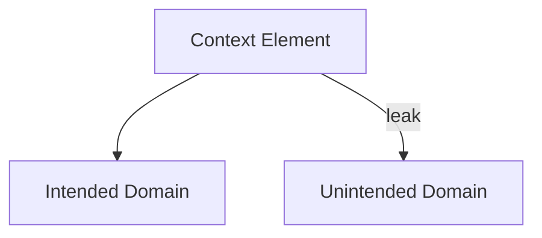

# Scope — Failure Signals

This document enumerates **observable signals** that indicate scope is missing, violated, or eroding.

Scope failure signals reveal **misapplication of otherwise valid context**.  
They are not about correctness of output, but about *where influence incorrectly applies*.

---

## Signal Model

Scope failures appear when **context leaks across applicability domains**.

If a context element affects domains it was not designed for, scope has failed.

---

## Task Scope Failure Signals

### Instruction Bleed Across Tasks

Observed behaviors:

- setup instructions influence later, unrelated tasks
- outputs reflect constraints from a previous objective
- task transitions do not reset assumptions

Interpretation:

- task boundaries are implicit or absent
- global context is assumed by default

Primary downstream failures:

- interference
- coordination collapse

---

### Task Identity Confusion

Observed behaviors:

- system appears unsure which task it is performing
- mixed-format outputs
- partial fulfillment of multiple objectives

Interpretation:

- multiple tasks active simultaneously
- no exclusive task scope enforced

---

## Role Scope Failure Signals

### Role Collapse

Observed behaviors:

- assistant alternates between policy, reasoning, and execution voices
- safety, explanation, and action blur together
- tone and responsibility shift mid-response

Interpretation:

- role boundaries are missing
- all roles share the same scope

Primary downstream failures:

- interference
- authority ambiguity

---

### Unintended Role Influence

Observed behaviors:

- evaluation criteria affect generation
- policy language appears in reasoning
- executor behaves like a reviewer

Interpretation:

- role-specific instructions are not isolated
- scope not enforced per role

---

## Phase Scope Failure Signals

### Phase Leakage

Observed behaviors:

- planning constraints limit execution flexibility
- evaluation standards bias generation
- correction logic interferes with initial reasoning

Interpretation:

- phase transitions are not enforced
- phases share context by default

Primary downstream failures:

- interference

---

### Non-Deterministic Phase Behavior

Observed behaviors:

- same task behaves differently depending on prior phase order
- reordering phases changes outcomes unexpectedly

Interpretation:

- phase scope is positional, not structural

---

## Agent Scope Failure Signals

### Cross-Agent Contamination

Observed behaviors:

- one agent’s assumptions appear in another’s output
- agent roles blur
- coordination becomes unstable

Interpretation:

- shared context without agent-level scoping

Primary downstream failures:

- interference

---

### Implicit Shared Memory

Observed behaviors:

- agents reference state they were never given
- memory updates affect unrelated agents

Interpretation:

- agent scope violated at persistence layer

---

## Artifact Scope Failure Signals

### Artifact Pollution

Observed behaviors:

- summaries encode transient instructions
- memory entries include task-specific constraints
- plans absorb evaluation criteria

Interpretation:

- artifact scope undefined
- persistence boundaries bypassed

Primary downstream failures:

- poisoning
- drift

---

### Downstream Constraint Propagation

Observed behaviors:

- later artifacts reflect assumptions from earlier ones
- corrections fail to remove constraints

Interpretation:

- artifact influence not bounded
- rollback impossible

---

## Distinguishing Scope Failure from Other Failures

| Observation                | Scope Failure?  |
| -------------------------- | --------------- |
| Wrong answer               | Not necessarily |
| Conflicting instructions   | Possibly        |
| Context leak across tasks  | Yes             |
| Role confusion             | Yes             |
| Stable but wrong objective | No (Drift)      |

Scope failures are about *misapplication*, not misalignment.

---

## Detection Guidance

Scope failures are detected by:

- resetting context between domains
- isolating roles experimentally
- reordering tasks or phases
- inspecting artifacts for foreign constraints

Output evaluation alone is insufficient.

---

## When to Escalate

Escalation is required when:

- scope leaks recur
- isolation fixes are ad hoc
- artifacts cannot be cleaned
- multi-task systems behave unpredictably

Scope erosion compounds quickly.

---

## Status

This document is **stable**.

Signals listed here are sufficient to detect scope failures before they manifest as higher-order system failures.
