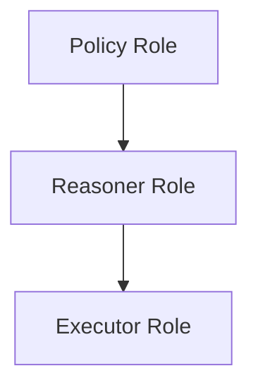
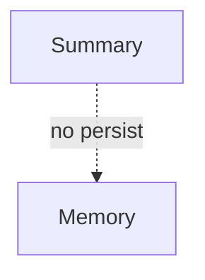

# Scope — Examples

This document provides **structural, execution-grounded examples** illustrating how scope operates, how it fails, and what enforcing scope changes.

These examples focus on **applicability control**, not output quality.

---

## Example 1: Task Scope in a Multi-Step Workflow

### Context

A system performs:
1. Task A: summarize a document
2. Task B: generate recommendations based on the summary

Instructions for Task A emphasize brevity and neutrality.

---

### Scope Failure (Without Task Scope)

Observed behavior:
- recommendations inherit summarization tone
- analysis is shallow
- constraints from Task A bleed into Task B

Root cause:
- Task A instructions treated as globally applicable

Downstream failures:
- interference
- degraded decision quality

---

### Scope Enforcement

Task scope applied:
- Task A instructions bound only to summarization
- Context cleared or re-scoped before Task B

---

### Outcome

- summarization remains constrained
- recommendations regain depth
- task objectives remain distinct

---

## Example 2: Role Scope in a Safety-Critical Assistant

### Context

An assistant operates under three roles:

- Policy interpreter
- Reasoner
- Executor

Instructions for policy interpretation include strict legal language.

---

### Scope Failure (Without Role Scope)

Observed behavior:

- legal language appears in execution output
- reasoning becomes overly cautious
- user experience degrades

Root cause:

- role instructions share a common scope

Downstream failures:

- interference
- authority ambiguity

---

### Scope Enforcement

Role scope applied:

- each role operates in an isolated scope
- outputs passed explicitly between roles

---

### Outcome

- policy informs reasoning without dominating it
- execution output stabilizes
- responsibilities are clear

---

## Example 3: Phase Scope in Planning and Execution

### Context

A system plans an action, then executes it.  
Planning includes hypothetical constraints and alternatives.

---

### Scope Failure (Without Phase Scope)

Observed behavior:

- execution hesitates due to hypothetical constraints
- alternatives appear in final output
- system appears indecisive

Root cause:

- planning assumptions persist into execution

Downstream failures:

- interference

---

### Scope Enforcement

Phase scope applied:

- planning context discarded or masked during execution

---

### Outcome

- execution is decisive
- planning flexibility preserved
- behavior becomes predictable

---

## Example 4: Agent Scope in a Multi-Agent System

### Context

Three agents collaborate:

- Research agent
- Synthesis agent
- Critique agent

They share a memory store.

---

### Scope Failure (Without Agent Scope)

Observed behavior:

- critique assumptions appear in synthesis prematurely
- research agent adapts to critique tone
- outputs oscillate

Root cause:

- shared context without agent-specific scoping

Downstream failures:

- interference

---

### Scope Enforcement

Agent scope applied:

- separate contexts per agent
- controlled handoff points

---

### Outcome

- agents remain focused
- collaboration becomes orderly
- coordination stabilizes

---

## Example 5: Artifact Scope in Memory and Summaries

### Context

A system generates:

- a working summary
- a long-term memory entry

Working summary includes temporary constraints.

---

### Scope Failure (Without Artifact Scope)

Observed behavior:

- temporary constraints enter long-term memory
- future sessions inherit outdated assumptions

Root cause:

- summary artifact treated as memory artifact

Downstream failures:

- drift
- poisoning

---

### Scope Enforcement

Artifact scope applied:

- summaries tagged as non-persistent
- memory writes gated separately

---

### Outcome

- memory remains clean
- summaries remain flexible
- long-term behavior stabilizes

---

## Example Invariants

Across all examples:

- failures arise without explicit errors
- scope defaults to global unless constrained
- enforcing scope localizes influence
- behavior improves indirectly

If applicability cannot be bounded, scope is missing.

---

## Status

This document is **stable**.

Examples provided here are sufficient to demonstrate scope as a primitive governing applicability across system domains.
