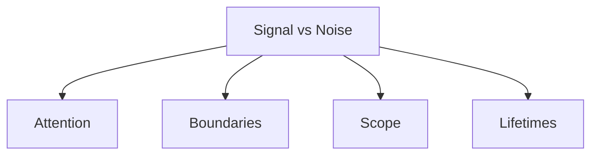
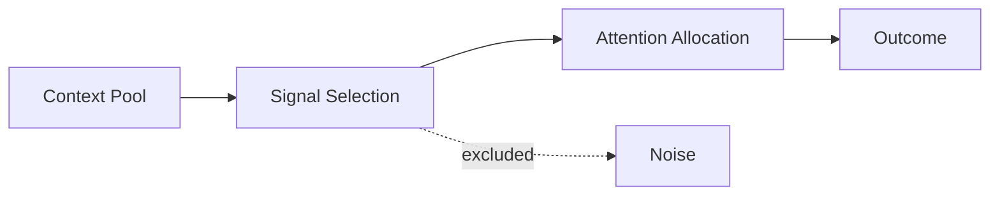
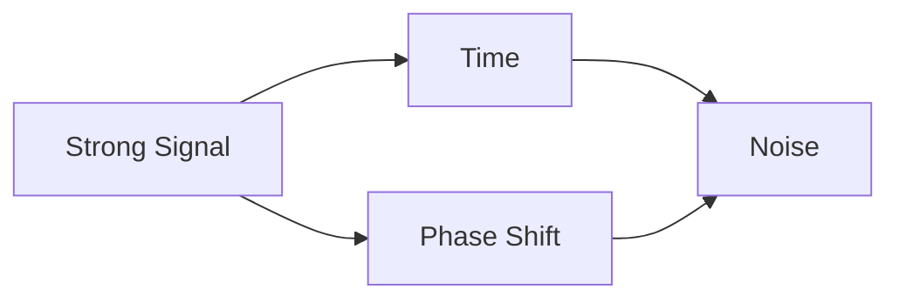

# Signal vs Noise

This specification defines **signal vs noise** as a foundational primitive in context-engineered systems.

Signal vs noise determines **what deserves attention at all**.  
It precedes selection, compression, ordering, and optimization.

If attention answers *how much* can be processed, and boundaries answer *where* influence flows, signal vs noise answers *what is worth processing*.

---

## Definition

**Signal** is context that increases the probability of achieving the intended outcome.  
**Noise** is context that does not, regardless of relevance, correctness, or verbosity.

Signal and noise are **situational**, not intrinsic properties of text.

---

## Why Signal vs Noise Is Primitive

Signal vs noise is primitive because:

- attention is scarce
- context windows accept everything indiscriminately
- models do not know intent unless specified
- relevance is task- and phase-dependent

Without explicit signal discrimination, systems degrade even when all inputs are “correct.”

---

## Signal Is Not Truth

A common error is equating signal with correctness.

- Correct but irrelevant context is noise.
- Incorrect but task-shaping context may still be signal (dangerously).

Signal is defined by **task contribution**, not accuracy.

---

## Noise Is Not Harmless

Noise is not neutral.

Effects of noise:
- dilutes attention
- masks weak signals
- amplifies interference
- increases degradation risk

Noise accumulates silently.

---

## Signal vs Noise and Other Primitives

- Signal selection determines attention load.
- Boundaries determine where signal may apply.
- Scope determines where signal is relevant.
- Lifetimes determine how long signal remains signal.

---

## Signal Is Phase-Dependent

The same context may shift classification.

Examples:

- planning assumptions are signal during planning, noise during execution
- evaluation criteria are signal during evaluation, noise during generation

Signal classification must be phase-aware.

---

## Quick Example (Execution)

**Situation**: A RAG pipeline retrieves 10 long articles; a one-line safety constraint sits in the prompt header.  
**Failure**: Responses mirror retrieved prose and ignore the safety constraint; the weak signal is drowned by verbose but relevant noise.  
**Intervention**: Mark the safety constraint as high-signal, cap retrieval budget, dedupe and trim to top-3 passages, and place constraints first.  
**Result**: Safety constraints apply consistently; answers stay on-task; retrieval remains useful without overwhelming attention.

---

## Execution Path (quick)

- **Inputs**: task/role/phase definition; signal taxonomy (high/medium/low); attention budget; retrieval/tool budgets.
- **Steps**: classify artifacts by signal; pin high-signal items first; cap and trim retrieval/tool outputs; dedupe; mask low-signal/noisy channels.
- **Checks**: high-signal items present and earliest; budgets respected; duplicates removed; weak signals not displacing constraints.
- **Stop/escate**: signal classification ambiguous; budget unknown; constraint would be demoted.

---

## Signal Is Role-Dependent

The same context may differ by role.

Examples:

- policy text is signal for policy interpretation
- policy text is noise for execution

Role scope determines signal validity.

---

## Noise Sources (Non-Exhaustive)

Common structural noise sources include:

- verbose explanations
- duplicated context
- outdated assumptions
- mixed-role instructions
- legacy constraints
- artifacts with expired lifetimes

Noise often originates from **previously-valid signal**.

---

## Signal Decay

Signal decays over time and across phases.

Without decay handling, systems accumulate noise even when no new inputs are added.

---

## Design Implications

From a system design perspective:

- signal selection must be explicit
- noise removal must be intentional
- defaults should bias toward exclusion
- classification must be revisited per phase

Systems that rely on “the model will figure it out” are mis-specified.

---

## Non-Claims

This specification does not claim:

- that signal can be perfectly identified
- that noise can be eliminated
- that signal is static
- that models infer signal reliably

It defines a constraint, not a solution.

---

## Status

This specification is **stable**.

It provides sufficient grounding to define signal failure signals, trade-offs, examples, and enforcement checks.
