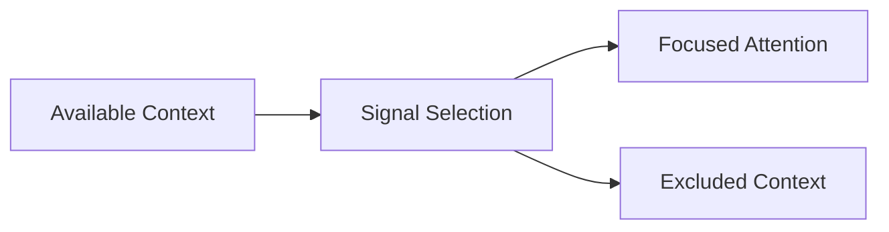

# Signal vs Noise — Trade-Offs

This document enumerates the **structural trade-offs introduced by explicitly distinguishing signal from noise**.

Signal discrimination does not improve correctness directly.  
It **reallocates attention**.

Every signal decision excludes something.

---

## Trade-Off Model

Signal selection trades **coverage** for **focus**.

Exclusion is not an accident.  
It is the cost of clarity.

---

## Aggressive Signal Selection Trade-Offs

**What aggressive selection improves**

- attention efficiency
- constraint adherence
- reduced degradation

**What it constrains**

- exploratory reasoning
- robustness to ambiguity
- recovery from misclassification

**Structural cost**

- brittle behavior if signal is misidentified
- higher upfront specification burden

**Failure if ignored**

- attention dilution
- silent constraint loss

Aggressive selection assumes confidence in intent.

---

## Conservative Signal Selection Trade-Offs

**What conservative selection improves**

- resilience to misclassification
- exploratory breadth
- tolerance for ambiguity

**What it constrains**

- attention efficiency
- constraint enforcement
- determinism

**Structural cost**

- slower convergence
- higher degradation risk

**Failure if ignored**

- signal drowned by noise

Conservative selection assumes uncertainty in intent.

---

## Verbosity vs Salience

**Reducing verbosity**

- improves salience
- risks omitting weak signals

**Allowing verbosity**

- preserves nuance
- increases noise surface

Length is not salience, but salience often requires brevity.

---

## Weak Signal Preservation Trade-Offs

**Preserving weak signals**

- protects edge cases
- improves safety and correctness

**Cost**

- increased attention load
- risk of overfitting to rare conditions

Weak signals matter disproportionately but consume attention inefficiently.

---

## Phase-Aware Signal Trade-Offs

**Phase-specific signal selection**

- improves clarity
- reduces cross-phase interference

**Cost**

- increased orchestration complexity
- context resets

Ignoring phase simplifies design but guarantees interference.

---

## Signal Decay Trade-Offs

**Fast decay**

- reduces noise accumulation
- risks forgetting still-relevant context

**Slow decay**

- preserves continuity
- increases drift risk

Decay rate is a governance choice.

---

## Signal Reclassification Trade-Offs

Reclassifying context over time:

- enables adaptation
- introduces instability

Failure to reclassify:

- stabilizes behavior
- guarantees noise accumulation

There is no neutral position.

---

## Interaction with Other Primitives

Signal vs noise interacts directly with:

- **Attention**: defines capacity pressure
- **Scope**: defines applicability
- **Lifetimes**: defines decay
- **Boundaries**: define influence eligibility

Misalignment amplifies failure modes.

---

## Signal Invariants

The following always hold:

- More context is not more signal.
- Noise grows faster than signal.
- Signal decays without revalidation.
- Exclusion always removes potential value.

Designs denying these are incomplete.

---

## Trade-Off Visibility Requirement

Signal trade-offs must be explicit.

Acceptable mechanisms:

- signal annotations
- selection criteria
- exclusion rationale
- decay rules

Implicit signal decisions become invisible failures.

---

## Relationship to Governance

Signal selection assigns responsibility.

As selection becomes stricter:

- accountability increases
- mistakes become obvious
- governance burden rises

Noise hides responsibility.  
Signal exposes it.

---

## Status

This document is **stable**.

Trade-offs listed here are sufficient to reason about signal vs noise decisions at the primitive level.
