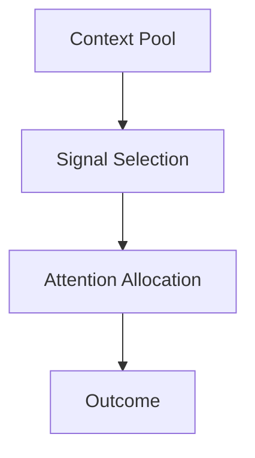

# Signal vs Noise — Checks

This document defines **executable checks** to verify that signal is intentionally selected, noise is controlled, and attention is allocated to context that actually contributes to the task.

Signal checks are **attention-governance checks**, not correctness checks.

A system may produce correct outputs while still failing signal vs noise checks.

---

## Check Model

Signal checks verify whether **attention is being spent on the right material**.

If attention allocation improves when context is removed, signal selection has failed.

---

## Check 1: Explicit Signal Declaration

**Question**  
Is it explicit which context elements are considered signal?

**How to run**

- Enumerate all context elements.
- Identify which are required for task success.

**Pass criteria**

- Signal elements are explicitly identified.
- Noise is not implicitly promoted by proximity or verbosity.

**Fail indicators**

- “Everything is important”
- Reliance on model intuition
- No distinction between reference and constraint

**Associated failures**

- Degradation
- Interference

---

## Check 2: Noise Removal Test

**Question**  
Does removing context improve or preserve performance?

**How to run**

- Remove half of the context arbitrarily.
- Observe output quality and constraint adherence.

**Pass criteria**

- Removal degrades performance.
- Critical constraints fail when removed.

**Fail indicators**

- Performance improves when context is removed
- Constraints become clearer after removal

**Associated failures**

- Degradation

---

## Check 3: Redundancy Audit

**Question**  
Is redundant context eliminated?

**How to run**

- Identify repeated facts, summaries, or constraints.
- Remove duplicates and re-test.

**Pass criteria**

- Each context element contributes new information.
- Summaries do not restate summaries.

**Fail indicators**

- Duplicate context
- Layered paraphrases without delta

**Associated failures**

- Degradation

---

## Check 4: Phase-Aware Signal Validation

**Question**  
Does signal classification change across phases?

**How to run**

- Inspect context at phase boundaries.
- Verify expired signal is removed or demoted.

**Pass criteria**

- Planning signal does not influence execution.
- Evaluation signal does not bias generation.

**Fail indicators**

- Cross-phase contamination
- Phase order affects outcomes

**Associated failures**

- Interference
- Drift

---

## Check 5: Role-Aware Signal Isolation

**Question**  
Is signal classification role-dependent?

**How to run**

- Inspect context visibility per role.
- Verify irrelevant role context is excluded.

**Pass criteria**

- Policy text does not shape execution.
- Evaluation criteria do not guide reasoning prematurely.

**Fail indicators**

- Role collapse
- Mixed tone or responsibility

**Associated failures**

- Interference

---

## Check 6: Signal Decay Enforcement

**Question**  
Does signal decay over time when not revalidated?

**How to run**

- Track long-lived context.
- Observe whether relevance is reassessed.

**Pass criteria**

- Legacy context is demoted or removed.
- Revalidation is required for continued inclusion.

**Fail indicators**

- Accumulated legacy constraints
- No decay mechanism

**Associated failures**

- Drift

---

## Check 7: Weak Signal Protection

**Question**  
Are short but critical signals preserved?

**How to run**

- Identify minimal constraints.
- Test whether they survive context expansion.

**Pass criteria**

- Constraints remain influential regardless of verbosity.
- Weak signals are elevated intentionally.

**Fail indicators**

- Constraints ignored when surrounded by text
- Length correlates with authority

**Associated failures**

- Degradation
- Interference

---

## Minimal Signal Audit (Checklist)

A system minimally conforms if all are true:

- [ ] Signal elements are explicit
- [ ] Removing context degrades performance
- [ ] Redundancy is controlled
- [ ] Signal is phase-aware
- [ ] Signal is role-aware
- [ ] Signal decays over time
- [ ] Weak signals are preserved

Failure of any item indicates signal vs noise failure.

---

## When to Re-run These Checks

Re-run signal checks when:

- context length increases
- performance degrades with more input
- constraints are ignored
- long sessions become unstable
- system complexity grows

Signal failures are often misdiagnosed as model limitations.

---

## Status

This document is **stable**.

Checks listed here are sufficient to verify signal vs noise discrimination as a foundational primitive governing attention allocation.
