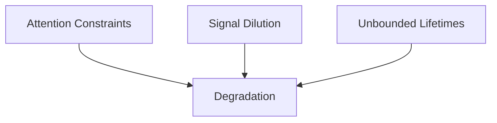
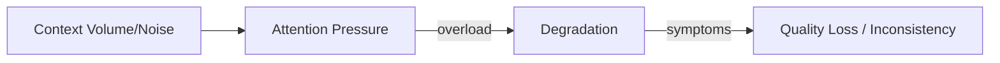
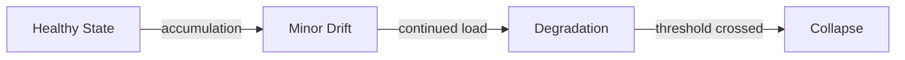

# Degradation

This specification defines **degradation** as a structural failure mechanic in context-engineered systems.

Degradation is the **progressive loss of output quality, reliability, or constraint adherence** as context evolves over time. It is not a sudden fault, not randomness, and not a capability limitation. It is a predictable consequence of unmanaged attention, signal dilution, and persistence.

---

## Definition

**Degradation** is a failure mechanic in which system behavior deteriorates gradually as competing context elements accumulate, persist beyond relevance, or distort signal distribution under attention constraints.

Key characteristics:

- **Progressive**: quality declines over time or turns
- **Silent**: no explicit error is required
- **Stateful**: past context influences future behavior
- **Non-linear**: small additions can trigger disproportionate decline

Degradation is often misattributed to “model fatigue” or “long conversations.” Those explanations are incomplete.

---

## What Degradation Is Not

Degradation is not:

- a single incorrect response
- prompt misphrasing
- model hallucination in isolation
- random variance between runs
- lack of domain knowledge

Those may co-occur with degradation, but they do not define it.

---

## Structural Causes

Degradation emerges from **interacting primitive violations**.

Typical contributing conditions include:

- unchecked accumulation of context
- signal-to-noise ratio decay
- persistence of outdated or weakly relevant information
- repeated compression without refresh
- reliance on ordering alone without selection

No single factor is sufficient. Degradation is cumulative.

---

## Degradation vs Sudden Failure

Degradation differs from abrupt failures in important ways.

- Early stages may appear acceptable
- Later stages reveal instability
- Collapse is a **result**, not the definition

Focusing only on collapse misses the failure mechanic.

---

## Common Misdiagnoses

Degradation is frequently misdiagnosed as:

- “The model is inconsistent”
- “The prompt needs refinement”
- “We need a larger context window”
- “The system worked earlier, so the logic is sound”

These responses address symptoms, not structure.

---

## Relationship to Attention

Degradation is the **canonical failure mode of unmanaged attention**.

As attention is redistributed across more elements:

- instructions lose relative authority
- reasoning depth becomes shallower
- retrieval is inconsistently applied
- tool outputs are partially integrated

Degradation is therefore expected unless explicitly mitigated.

---

## Interaction With Other Failure Mechanics

Degradation often co-occurs with:

- **Interference**: competing elements distort behavior
- **Drift**: gradual deviation from original intent

However:

- Degradation concerns **quality decay**
- Interference concerns **conflict**
- Drift concerns **directional change**

They must be distinguished to select correct controls.

---

## Why Degradation Persists in Production

Degradation survives because:

- early outputs remain “good enough”
- failures appear qualitative rather than binary
- responsibility is diffused across time
- monitoring favors correctness over consistency

Systems may ship and scale while degrading silently.

---

## Implications for Design

From a design perspective:

- any persistent context introduces degradation risk
- accumulation without expiration is unsafe
- compression without refresh accelerates decay
- “just add more context” increases fragility

Designs that do not assume degradation are mis-specified.

---

## Non-Claims

This specification does not claim:

- a universal degradation rate
- identical degradation patterns across models
- that degradation can be eliminated
- that degradation always manifests visibly

It defines the failure mechanic, not its remediation.

---

---

## Execution Path (quick)

- **Inputs**: attention budget; context assembly (history/retrievals/tool outputs); constraint list with authority; signal classification
- **Steps**: measure attention load; identify high-signal constraints; cap and trim retrieval/tool outputs; compress/dedupe history; reorder to put constraints first
- **Checks**: budget under target; constraints present earliest; duplicates removed; verbose/noisy channels masked; weak signals preserved
- **Stop/escate**: budget unknown; constraint would be dropped/compressed; provenance missing for required constraints

---

## References

The existence and behavior of degradation are supported by empirical research and production observations, including but not limited to:

- Liu et al., **Lost in the Middle: How Language Models Use Long Contexts**, 2023
- Press et al., **Measuring and Narrowing the Compositionality Gap in Language Models**, 2022
- Chen et al., **Evaluating Large Language Models on Long-Context Tasks**, 2023
- Wu et al., **Scaling Laws for Forgetting in Language Models**, 2023
- Anthropic, **On the Risks of Persistent Context and Long-Horizon Agents**, 2023

These references demonstrate that quality decay, attention dilution, and long-context instability are observed phenomena, not theoretical edge cases.

---

## Status

This specification is **stable**.

It is sufficient to ground failure signals, control selection, trade-off analysis, and governance decisions related to degradation.
