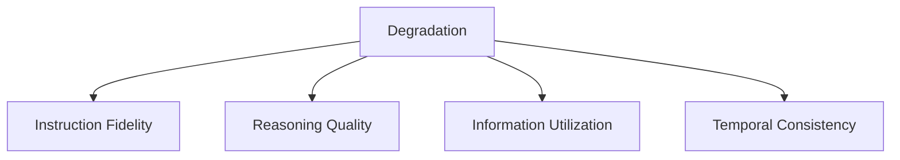
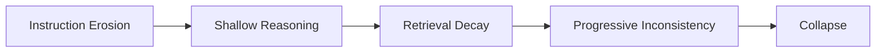

# Degradation — Failure Signals

This document enumerates **observable failure signals** that indicate degradation is occurring or imminent.

Failure signals are **diagnostic indicators**, not root causes.
They describe _what can be observed_ in system behavior before degradation is formally acknowledged or corrected.

---

## Signal Domains

Degradation surfaces across multiple observable domains. Signals may appear in one domain before others.

Signals compound over time.

---

## Instruction Fidelity Signals

### Gradual Constraint Erosion

Observed behaviors:

- constraints are followed early in a session but ignored later
- “soft” instructions disappear before “hard” ones
- system rules are inconsistently applied

Interpretation:

- attention share allocated to instructions is shrinking
- accumulated context is diluting instruction salience

This is a **primary early signal** of degradation.

---

### Inconsistent Obedience Across Turns

Observed behaviors:

- identical instructions produce different levels of compliance
- behavior changes without explicit context change
- compliance depends on recent context density

Interpretation:

- attention distribution is unstable
- prioritization is no longer deterministic

---

## Reasoning Quality Signals

### Shallowing of Reasoning Depth

Observed behaviors:

- reduced explanation length
- skipped intermediate steps
- premature conclusions under similar tasks

Interpretation:

- insufficient attention to sustain multi-step reasoning
- reasoning chains are truncated by competing context

Often misdiagnosed as a capability issue.

---

### Intra-Session Logical Drift

Observed behaviors:

- reasoning standards vary within the same session
- later answers contradict earlier logic
- rigor declines without task change

Interpretation:

- attention saturation increases progressively
- reasoning quality decays before correctness visibly fails

---

## Information Utilization Signals

### Retrieval Influence Decay

Observed behaviors:

- retrieved documents are present but weakly reflected
- citations appear without influencing conclusions
- factual grounding becomes inconsistent

Interpretation:

- retrieval loses attention competition as context grows
- inclusion without prioritization is ineffective

---

### Tool Output Integration Loss

Observed behaviors:

- tool outputs are partially or incorrectly used
- repeated tool calls without improvement
- reasoning proceeds as if tools were not invoked

Interpretation:

- tool outputs are not salient enough to affect reasoning
- accumulated context overwhelms tool relevance

---

## Temporal Consistency Signals

### Progressive Quality Decline

Observed behaviors:

- gradual reduction in answer quality over turns
- increasing verbosity with decreasing substance
- rising inconsistency across similar queries

Interpretation:

- cumulative attention stress
- classic degradation trajectory

This signal is frequently **silent**.

---

### Threshold Collapse

Observed behaviors:

- sudden and disproportionate quality failure
- abrupt loss of instruction adherence
- erratic prioritization after a minor context addition

Interpretation:

- attention saturation crossed a non-linear threshold
- degradation transitioned into visible failure

Collapse is an outcome, not the definition.

---

## Cross-Signal Progression

Degradation typically progresses in a recognizable sequence:

Intervening early alters outcomes.

---

## Distinguishing Degradation from Other Failures

Degradation is often confused with adjacent failure mechanics.

| Failure      | Key Difference                             |
| ------------ | ------------------------------------------ |
| Interference | Competing elements conflict immediately    |
| Drift        | Direction changes, not quality decay       |
| Poisoning    | Incorrect premises, not attention dilution |

Misclassification leads to incorrect control selection.

---

## Detection Guidance

Signals may be detected through:

- longitudinal session review
- short-context vs long-context comparison
- regression testing over accumulated context
- human qualitative review

Detection mechanisms belong downstream.
This document defines **what to observe**, not **how to fix**.

---

## When to Escalate

Escalation is required when:

- multiple signal domains activate simultaneously
- degradation persists across resets
- human review cannot restore stability

Degradation left unaddressed becomes systemic.

---

## References

Empirical evidence for degradation-related signals includes:

- Liu et al., **Lost in the Middle: How Language Models Use Long Contexts**, 2023
  Demonstrates declining utilization of relevant information as context grows.

- Chen et al., **Evaluating Large Language Models on Long-Context Tasks**, 2023
  Shows quality decay, instruction adherence loss, and inconsistent reasoning under long contexts.

- Press et al., **Measuring and Narrowing the Compositionality Gap in Language Models**, 2022
  Provides evidence of reasoning depth collapse under increased contextual load.

- Wu et al., **Scaling Laws for Forgetting in Language Models**, 2023
  Documents progressive forgetting and instability across extended sequences.

- Anthropic, **On the Risks of Persistent Context and Long-Horizon Agents**, 2023
  Describes silent degradation, threshold collapse, and compounding failure in agent systems.

These works support the observability and repeatability of degradation signals across models and deployment settings.

---

## Status

This document is **stable**.

Signals listed here are considered sufficient to detect degradation across models, agent architectures, and operational contexts.
