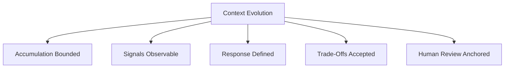

# Degradation — Checks

This document defines **executable checks** to verify whether degradation risk is identified, bounded, and governed.

Checks are **gates**, not advice.
Failure to pass a check indicates mis-specification or missing governance, not a need for more controls.

---

## Check Model

Degradation checks validate five conditions:

All conditions must be satisfied.

---

## Check 1: Accumulation Boundaries

**Question**
Is context accumulation explicitly bounded over time?

**How to run**

- Identify all context sources that persist across turns.
- Verify existence of selection, expiration, or reset boundaries.

**Pass criteria**

- Every persistent context source has a defined limit or lifetime.
- No unbounded growth paths exist.

**Fail indicators**

- “Keep everything” policies
- Indefinite memory retention
- Accumulation justified only by context window size

**Associated failure signals**

- Progressive quality decline
- Threshold collapse

---

## Check 2: Signal Detectability

**Question**
Can degradation be detected before collapse?

**How to run**

- Compare outputs under short vs accumulated context.
- Review reasoning depth, constraint adherence, and utilization consistency.

**Pass criteria**

- At least one early degradation signal is observable.
- Detection does not rely on explicit errors.

**Fail indicators**

- Quality issues only noticed after severe failure
- No longitudinal evaluation
- Reliance on user complaints as detection

**Associated failure signals**

- Instruction erosion
- Shallow reasoning
- Retrieval influence decay

---

## Check 3: Control–Signal Alignment

**Question**
Are controls selected in response to observed degradation signals?

**How to run**

- Map active controls to the signals they mitigate.
- Verify controls were not applied prophylactically without diagnosis.

**Pass criteria**

- Each control addresses a documented signal.
- No control is justified as a universal fix.

**Fail indicators**

- Compression applied by default
- Ordering used without selection
- Lifetime policies introduced without evidence of accumulation

**Associated failure signals**

- Misapplied mitigation
- Accelerated degradation

---

## Check 4: Trade-Off Declaration

**Question**
Are the trade-offs introduced by degradation controls explicitly acknowledged?

**How to run**

- For each control, enumerate irreversible costs.
- Verify acceptance at design or review time.

**Pass criteria**

- Trade-offs are documented and accepted.
- Governance strength matches trade-off severity.

**Fail indicators**

- Controls described as “improvements”
- Irreversible actions without review gates
- Assumption that mitigation is cost-free

**Associated failure signals**

- Silent omission
- Drift acceleration

---

## Check 5: Refresh and Recovery Paths

**Question**
Is there a defined path to refresh or recover from degradation?

**How to run**

- Identify how lost signal or fidelity is restored.
- Verify escalation triggers when controls are insufficient.

**Pass criteria**

- Refresh from source data is possible.
- Escalation criteria are defined.

**Fail indicators**

- Permanent reliance on compressed or pruned context
- No manual intervention path
- Degradation treated as acceptable background noise

**Associated failure signals**

- Persistent quality decay
- Irrecoverable collapse

---

## Check 6: Human Review Anchors

**Question**
Are humans explicitly responsible for detecting and responding to degradation?

**How to run**

- Identify review points for long-running or high-impact tasks.
- Verify ownership and escalation authority.

**Pass criteria**

- Review cadence is defined.
- Responsibility is assigned.

**Fail indicators**

- Fully automated long-horizon operation
- No ownership of degradation outcomes

**Associated failure signals**

- Undetected degradation
- Systemic failure propagation

---

## Minimal Degradation Audit (Checklist)

A system minimally conforms if all are true:

- [ ] Context accumulation is bounded
- [ ] Early degradation signals are observable
- [ ] Controls map to diagnosed signals
- [ ] Trade-offs are explicit and accepted
- [ ] Refresh or escalation paths exist
- [ ] Human review responsibility is assigned

Failure of any item indicates non-conformance.

---

## When to Re-run These Checks

Re-run degradation checks when:

- persistent context sources change
- summarization or compression logic is updated
- retrieval scope is modified
- system lifetime expectations increase
- agent autonomy expands

Degradation is cumulative. Checks are not one-time.

---

## Status

This document is **stable**.

Checks listed here are sufficient to verify that degradation is recognized, bounded, and governed in context-engineered systems.
