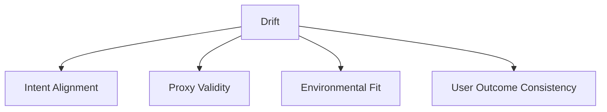

# Drift — Failure Signals

This document enumerates **observable failure signals** that indicate drift is occurring or imminent.

Failure signals describe **misalignment between intent and behavior**, not loss of capability.  
They are often subtle, stable, and internally “successful”.

---

## Signal Domains

Drift manifests across alignment and meaning, not performance.

Signals frequently emerge outside the system boundary.

---

## Intent Alignment Signals

### Stable Outputs With Changed Meaning

Observed behaviors:

- outputs remain consistent over time
- responses are internally coherent
- conclusions no longer match original intent

Interpretation:

- the system is optimizing a stale objective
- internal correctness masks external misalignment

This is a **primary drift signal**.

---

### Proxy Substitution

Observed behaviors:

- secondary indicators become treated as primary goals
- proxy success is reported as system success
- original intent is no longer explicitly referenced

Interpretation:

- proxies have replaced objectives
- success criteria have narrowed silently

Often mistaken for optimization.

---

## Proxy Validity Signals

### Feature or Heuristic Obsolescence

Observed behaviors:

- reliance on features that no longer correlate with outcomes
- confident decisions based on outdated patterns
- increasing false negatives or false positives externally

Interpretation:

- proxy decay due to environmental change
- no internal signal of failure

---

### Reinforced Misalignment

Observed behaviors:

- feedback loops strengthen outdated behavior
- system becomes more confident in wrong classifications
- adaptation worsens alignment

Interpretation:

- reinforcement without external grounding
- drift accelerates under learning pressure

---

## Environmental Fit Signals

### Distribution Shift Insensitivity

Observed behaviors:

- system behavior unchanged despite environment change
- performance metrics remain stable internally
- user-reported failures increase

Interpretation:

- system lacks mechanisms to detect meaning shift
- environment has moved, system has not

---

### Temporal Success Illusion

Observed behaviors:

- historical benchmarks continue to pass
- new edge cases consistently fail
- system “looks correct” on legacy tests

Interpretation:

- validation regime is outdated
- success criteria lag reality

---

## User Outcome Signals

### Outcome–Intent Divergence

Observed behaviors:

- users receive outcomes opposite to intent
- complaints contradict system metrics
- success measured internally conflicts with lived experience

Interpretation:

- drift has crossed from latent to harmful
- alignment gap is now visible externally

---

### Confidence Without Correction

Observed behaviors:

- high confidence outputs persist despite negative outcomes
- no internal uncertainty escalation
- no corrective behavior triggered

Interpretation:

- system lacks alignment self-checks
- drift is fully silent internally

---

## Drift vs Degradation Signals

Drift signals differ fundamentally from degradation signals.

| Dimension   | Degradation    | Drift              |
| ----------- | -------------- | ------------------ |
| Quality     | Declines       | Stable             |
| Confidence  | Often drops    | Often remains high |
| Detection   | Internal       | External           |
| Progression | Capacity-based | Meaning-based      |

Misreading drift as degradation leads to ineffective mitigation.

---

## Detection Guidance

Drift detection requires **external reference**, including:

- intent reviews
- outcome audits
- user feedback analysis
- environment change monitoring

Internal metrics alone are insufficient.

---

## When to Escalate

Escalation is required when:

- intent–outcome divergence persists
- proxies can no longer be justified
- environment has materially changed
- system confidence remains high despite harm

Drift without escalation becomes systemic misalignment.

---

## References

Evidence for drift-related signals includes:

- Gama et al., **A Survey on Concept Drift Adaptation**, 2014
- Widmer & Kubat, **Learning in the Presence of Concept Drift**, 1996
- Sculley et al., **Hidden Technical Debt in Machine Learning Systems**, 2015
- Amodei et al., **Concrete Problems in AI Safety**, 2016
- Anthropic, **On the Risks of Long-Horizon Agents**, 2023

These works document stable performance masking alignment failure across adaptive systems.

---

## Status

This document is **stable**.

Signals listed here are sufficient to detect drift independent of degradation or interference.
