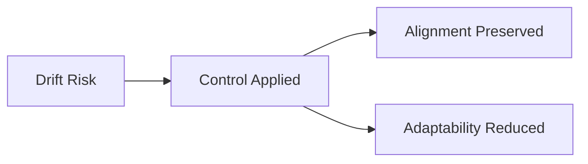
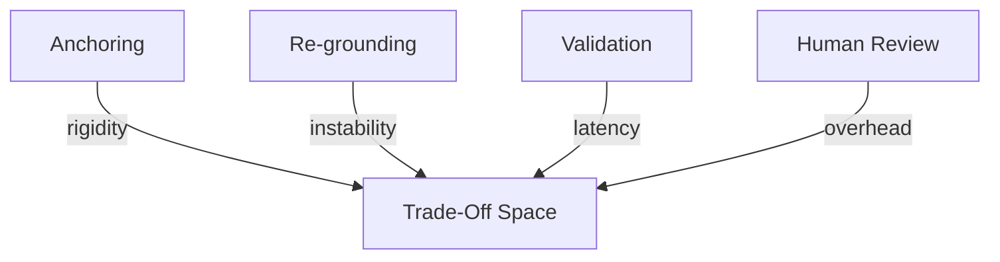

# Drift — Trade-Offs

This document enumerates the **structural trade-offs** introduced when applying controls to mitigate drift.

Drift mitigation is never free.  
Every control that preserves alignment constrains autonomy, adaptability, or speed.

---

## Trade-Off Model

Drift controls exchange **autonomy for alignment**.

Failing to acknowledge these costs converts governance into hidden failure.

---

## Trade-Offs by Control

### Anchoring

**What it preserves**

- intent stability
- invariant definitions
- resistance to silent reinterpretation

**What it constrains**

- adaptive behavior
- responsiveness to environment change
- local optimization

**Irreversibility**

- strong anchors resist correction once outdated

**When this becomes dangerous**

- environment evolves rapidly
- intent assumptions expire without review

Anchoring prevents drift by risking rigidity.

---

### Re-grounding

**What it preserves**

- alignment with current reality
- relevance of objectives
- proxy validity

**What it constrains**

- operational continuity
- system stability during refresh
- throughput during realignment

**Irreversibility**

- re-grounding invalidates prior state
- historical continuity may be lost

**When this becomes dangerous**

- re-grounding cadence is too frequent
- authority to redefine intent is unclear

Re-grounding corrects drift by disrupting flow.

---

### Validation

**What it preserves**

- correctness relative to intent
- detection of proxy decay
- accountability

**What it constrains**

- iteration speed
- autonomy of automated decisions
- reliance on internal metrics

**Irreversibility**

- invalidated outcomes must be revisited
- decision pipelines may stall

**When this becomes dangerous**

- validation criteria lag reality
- validation lacks enforcement power

Validation surfaces drift by slowing execution.

---

### Human Review

**What it preserves**

- meaning alignment
- normative judgment
- authority over intent changes

**What it constrains**

- scalability
- consistency across reviewers
- automation benefits

**Irreversibility**

- human decisions redefine success
- reversals carry organizational cost

**When this becomes dangerous**

- review becomes symbolic
- authority is ambiguous or diluted

Human review resolves drift by centralizing responsibility.

---

## Cross-Control Trade-Offs

Controls amplify each other’s costs.

Common compound risks:

- **Anchoring without re-grounding** → frozen misalignment
- **Re-grounding without anchoring** → oscillation
- **Validation without authority** → ignored findings
- **Human review without structure** → inconsistency

Coordination is mandatory.

---

## Trade-Off Invariants

The following always hold:

- Preserving alignment reduces autonomy.
- Increasing adaptability risks misalignment.
- External grounding increases cost.
- Governance reduces throughput.

Any design that violates these statements is mis-specified.

---

## Trade-Off Visibility Requirement

All drift controls must surface trade-offs explicitly.

Acceptable mechanisms:

- intent change logs
- validation reports
- review decisions
- escalation records

Hidden trade-offs are treated as governance failures.

---

## Relationship to Governance

Drift mitigation is governance-dominant.

As drift controls intensify:

- decision authority must be explicit
- accountability must be assigned
- automation must retreat

Drift is resolved by choice, not tuning.

---

## References

Trade-offs described here align with established findings in:

- Gama et al., **A Survey on Concept Drift Adaptation**, 2014
- Sculley et al., **Hidden Technical Debt in Machine Learning Systems**, 2015
- Amodei et al., **Concrete Problems in AI Safety**, 2016
- Anthropic, **On the Risks of Long-Horizon Agents**, 2023

These works show that alignment preservation necessarily constrains system autonomy.

---

## Status

This document is **stable**.

Trade-offs listed here are considered exhaustive for drift mitigation at the failure-mechanics level.
