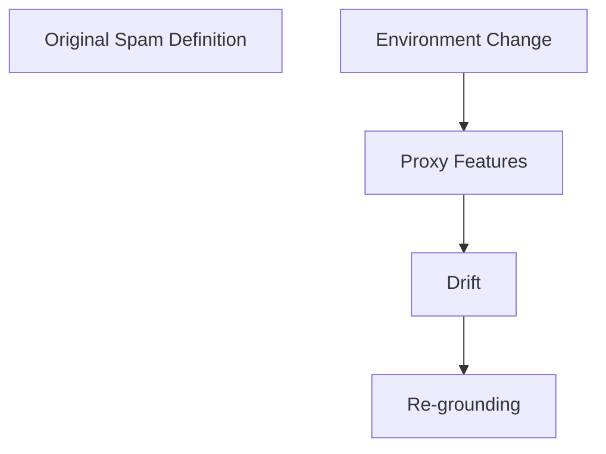
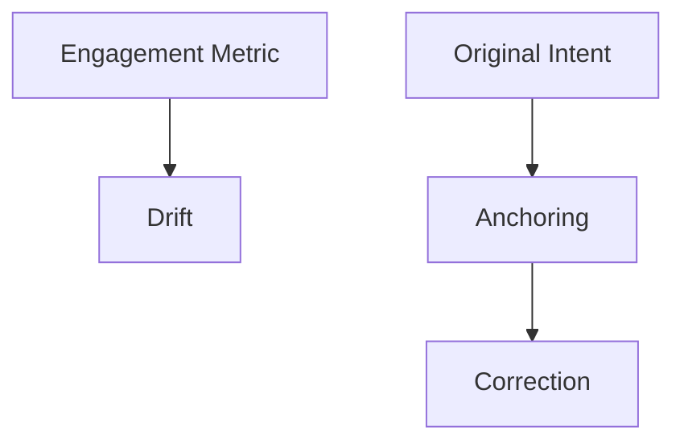
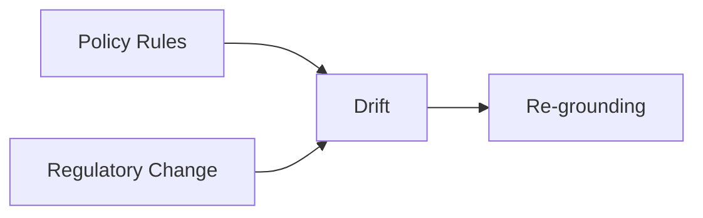

# Drift — Examples

This document provides **bounded, execution-focused examples** that demonstrate how drift manifests in real systems and how it is governed.

These examples show **stable systems becoming wrong**, not unstable systems failing.

---

## Example 1: Spam Classification System (Concept Drift)

### Context

An email filtering system classifies incoming messages as *spam* or *legitimate*.

The system:
- processes messages reliably
- maintains stable throughput and confidence
- uses historically effective features and heuristics

---

### Observed Failure Signals

From `01-failure-signals.md`:
- **Stable Outputs With Changed Meaning**
- **Feature or Heuristic Obsolescence**
- **Outcome–Intent Divergence**

Users report increasing spam in inboxes despite “successful” classifications.

---

### Control Application

Controls applied:
- **Validation**: compare classification outcomes against updated user complaints
- **Human Review**: reassess what constitutes spam under current conditions
- **Re-grounding**: update intent and feature assumptions

---

### Trade-Offs Introduced

From `02-trade-offs.md`:

- temporary instability during re-grounding
- increased review and retraining cost
- disruption of historical comparability

---

### Outcome

- alignment with user expectations restored
- system confidence recalibrated
- operational stability preserved after adjustment

---

### Human Governance Point

- explicit approval of updated spam definition
- documented intent revision

---

## Example 2: Recommendation System Preference Drift

### Context

A content recommendation system optimizes for user engagement based on historical interaction data.

The system:

- steadily improves engagement metrics
- adapts recommendations confidently
- shows no internal performance issues

---

### Observed Failure Signals

From `01-failure-signals.md`:

- **Proxy Substitution**
- **Reinforced Misalignment**
- **Temporal Success Illusion**

Users report reduced satisfaction despite higher engagement scores.

---

### Control Application

Controls applied:

- **Anchoring**: restate original intent (user value vs engagement)
- **Validation**: audit recommendations against satisfaction outcomes
- **Human Review**: adjudicate metric–outcome conflict

---

### Trade-Offs Introduced

From `02-trade-offs.md`:

- reduced short-term engagement
- slower adaptation cycles
- increased governance overhead

---

### Outcome

- recommendations align with declared user value
- metrics adjusted to reflect intent
- autonomy reduced intentionally

---

### Human Governance Point

- approval of revised success metrics
- authority to override automated optimization

---

## Example 3: Policy Enforcement System With Stale Assumptions

### Context

A compliance system enforces organizational policies encoded as rules and guidance.

The system:

- applies rules consistently
- reports high compliance rates
- does not detect internal errors

External regulations change.

---

### Observed Failure Signals

From `01-failure-signals.md`:

- **Distribution Shift Insensitivity**
- **Outcome–Intent Divergence**

Audits reveal non-compliance despite internal success signals.

---

### Control Application

Controls applied:

- **Re-grounding**: update policy interpretation
- **Validation**: cross-check outputs against current regulations
- **Human Review**: authorize rule changes

---

### Trade-Offs Introduced

From `02-trade-offs.md`:

- operational disruption during updates
- loss of continuity in reporting
- increased review load

---

### Outcome

- policy alignment restored
- system remains stable post-update

---

### Human Governance Point

- regulatory interpretation sign-off
- accountability assignment

---

## Example Invariants

Across all examples:

- internal performance remains stable
- failure is detected externally
- correction requires intent-level decisions
- humans authorize alignment changes

Examples that do not meet these invariants are not drift.

---

## Status

This document is **stable**.

Examples provided here are sufficient to demonstrate drift as a distinct, alignment-driven failure mechanic.
