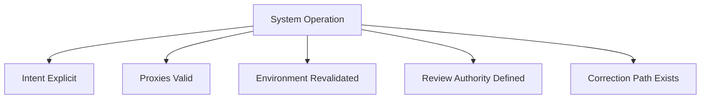

# Drift — Checks

This document defines **executable checks** to verify whether drift risk is detected, governed, and corrected.

Checks are **alignment gates**, not performance tests.  
A system that passes internal metrics but fails these checks is drifting by definition.

---

## Check Model

Drift checks validate five conditions:

Failure of any condition indicates unmanaged drift.

---

## Check 1: Intent Explicitness

**Question**  
Is the system’s current intent explicitly stated and versioned?

**How to run**

- Locate the declared intent governing decisions.
- Verify it is documented, current, and authoritative.

**Pass criteria**

- Intent is explicitly defined.
- Intent has an owner and review cadence.
- Intent changes are logged.

**Fail indicators**

- Intent inferred from metrics alone
- Multiple conflicting success definitions
- No ownership of intent

**Associated failure signals**

- Stable outputs with changed meaning
- Proxy substitution

---

## Check 2: Proxy Validity Review

**Question**  
Are the proxies used by the system still valid representations of intent?

**How to run**

- Enumerate proxies (metrics, features, heuristics).
- Justify their relevance to current intent and environment.

**Pass criteria**

- Each proxy has a documented rationale.
- Proxies are periodically revalidated.

**Fail indicators**

- “We’ve always used this metric”
- Proxies treated as objectives
- No review cycle

**Associated failure signals**

- Feature obsolescence
- Reinforced misalignment

---

## Check 3: Environmental Change Awareness

**Question**  
Does the system detect or account for changes in its operating environment?

**How to run**

- Identify assumptions about users, data, or regulation.
- Verify mechanisms to detect or respond to change.

**Pass criteria**

- Environment changes trigger review.
- Assumptions are time-bound.

**Fail indicators**

- Static assumptions
- External change ignored
- Reliance on historical benchmarks only

**Associated failure signals**

- Distribution shift insensitivity
- Temporal success illusion

---

## Check 4: Validation Against Outcomes

**Question**  
Are outputs validated against real-world outcomes, not just internal metrics?

**How to run**

- Compare system outputs to external effects.
- Review discrepancies between metrics and outcomes.

**Pass criteria**

- Outcome audits exist.
- Metric–outcome conflicts are investigated.

**Fail indicators**

- Metrics treated as truth
- User or audit feedback ignored
- No escalation path

**Associated failure signals**

- Outcome–intent divergence
- Confidence without correction

---

## Check 5: Authority to Correct Drift

**Question**  
Is there clear authority to redefine intent and correct misalignment?

**How to run**

- Identify who can approve intent changes.
- Verify enforcement of decisions.

**Pass criteria**

- Authority is explicit.
- Corrections are enacted, not advisory.

**Fail indicators**

- Findings without action
- Advisory reviews only
- Ambiguous decision rights

**Associated failure signals**

- Persistent drift
- Systemic misalignment

---

## Check 6: Correction and Re-grounding Path

**Question**  
Is there a defined path to re-ground the system when drift is confirmed?

**How to run**

- Identify mechanisms to update assumptions, proxies, or intent.
- Verify ability to invalidate prior state.

**Pass criteria**

- Re-grounding steps are documented.
- Historical state can be reset or revised.

**Fail indicators**

- Drift acknowledged but untreated
- No mechanism to revise system behavior
- Fear of disruption blocks correction

**Associated failure signals**

- Long-lived misalignment
- Recurrent outcome failures

---

## Minimal Drift Audit (Checklist)

A system minimally conforms if all are true:

- [ ] Intent is explicit, owned, and versioned
- [ ] Proxies are justified and revalidated
- [ ] Environment change triggers review
- [ ] Outcomes are audited externally
- [ ] Authority to correct drift is clear
- [ ] Re-grounding path exists

Failure of any item indicates unmanaged drift.

---

## When to Re-run These Checks

Re-run drift checks when:

- environment or users change materially
- proxies or metrics are updated
- system autonomy increases
- learning or adaptation is introduced
- external complaints rise despite good metrics

Drift is cumulative. Checks must recur.

---

## Status

This document is **stable**.

Checks listed here are sufficient to detect, govern, and correct drift as an alignment failure mechanic.
