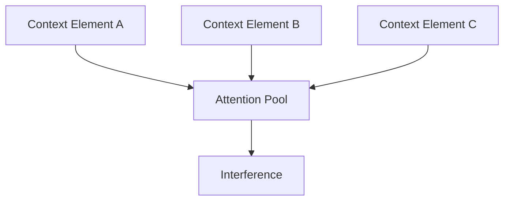
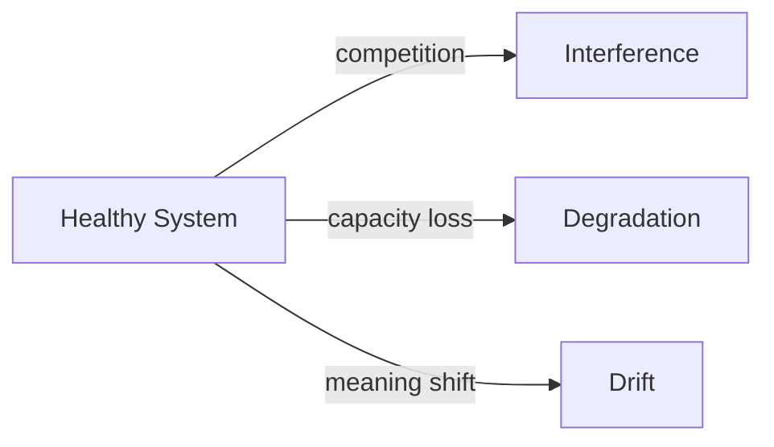

# Interference

This specification defines **interference** as a structural failure mechanic in context-engineered systems.

Interference occurs when **multiple context elements simultaneously compete for authority**, causing behavior to be distorted, conflicted, or selectively obedient.  
Unlike degradation or drift, interference can appear **suddenly** and does not require time-based accumulation or environmental change.

---

## Definition

**Interference** is a failure mechanic in which otherwise valid context elements interact in ways that corrupt decision-making, reasoning, or instruction adherence.

Key characteristics:

- **Concurrent**: multiple signals are active at the same time  
- **Conflict-driven**: elements contradict or dilute each other  
- **Non-progressive**: may appear immediately  
- **Attention-mediated**: driven by competition within the attention window  

Interference is a failure of **coordination**, not capacity or intent.

---

## What Interference Is Not

Interference is not:

- gradual quality decay (degradation)  
- directional misalignment (drift)  
- random inconsistency  
- hallucination in isolation  
- lack of knowledge  

A system can be fully capable and aligned and still fail due to interference.

---

## Canonical Examples (Grounding)

Typical interference scenarios include:

- system instructions conflicting with tool outputs  
- retrieved documents contradicting each other  
- multiple agents writing into shared context  
- safety constraints diluted by verbose user input  
- legacy rules clashing with newly injected policies  

In all cases, **nothing is individually wrong**.  
The failure emerges from interaction.

---

## Structural Causes

Interference emerges when **boundaries and scopes are underspecified**.

Common contributing conditions include:

- multiple sources with equal authority
- lack of isolation between roles or agents
- overlapping scopes of responsibility
- unprioritized constraints
- simultaneous injection of context without arbitration

Interference does not require accumulation.

---

## Interference vs Other Failure Mechanics

Interference is distinct from other failures.

| Dimension       | Interference   | Degradation | Drift       |
| --------------- | -------------- | ----------- | ----------- |
| Primary axis    | Coordination   | Capacity    | Alignment   |
| Time dependency | Immediate      | Progressive | Persistent  |
| Stability       | Often unstable | Declining   | Stable      |
| Root cause      | Conflict       | Saturation  | Proxy decay |

Misclassification leads to ineffective mitigation.

---

## Why Interference Persists in Production

Interference persists because:

- individual components test cleanly in isolation
- failures appear nondeterministic
- responsibility is diffused across components
- logs show “correct” inputs
- arbitration logic is implicit or absent

Interference often appears as flakiness.

---

## Implications for Design

From a design perspective:

- context sources must be scoped and ranked
- authority must be explicit
- concurrency requires arbitration
- isolation is not optional in multi-agent systems

Systems that assume cooperation without coordination are mis-specified.

---

## Non-Claims

This specification does not claim:

- a universal priority scheme
- that interference can be fully prevented
- that more context reduces interference
- that models can resolve conflicts autonomously

It defines the failure mechanic, not its remediation.

---

---

## Execution Path (quick)

- **Inputs**: authority model; scope map (task/role/phase); channel definitions; context assembly
- **Steps**: separate instructions by scope/role/channel; enforce authority ordering; block instruction smuggling via data/tools; isolate cross-task bleed; reorder constraints first
- **Checks**: higher authority intact; out-of-scope items removed; channels respected; constraints precede background
- **Stop/escate**: authority conflict unresolved; scope ambiguous; constraint would be displaced

---

## References

Foundational and applied work informing interference includes:

- Liu et al., **Lost in the Middle: How Language Models Use Long Contexts**, 2023
- Shanahan et al., **Role-Playing and Multi-Agent Failure Modes**, 2023
- Anthropic, **On the Risks of Multi-Agent Systems**, 2023
- Sculley et al., **Hidden Technical Debt in Machine Learning Systems**, 2015

These works document conflict, coordination failure, and attention competition in complex AI systems.

---

---

## Related

- **Primitives**: `boundaries`, `scope`, `attention`
- **Failures**: `interference`
- **Controls**: `ordering`, `selection`, `isolation`, `masking`

## Status

This specification is **stable**.

It is sufficient to ground failure signals, controls, trade-offs, examples, and checks related to interference.
