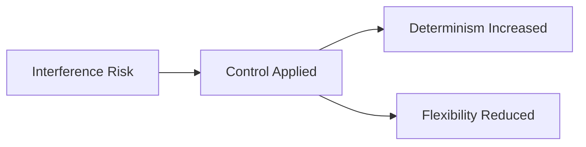
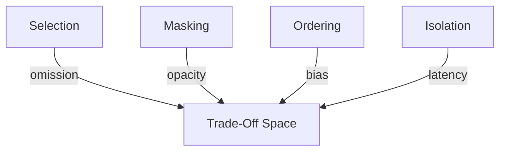

# Interference — Trade-Offs

This document enumerates the **structural trade-offs** introduced when applying controls to mitigate interference.

Interference mitigation trades **parallelism and flexibility** for **determinism and authority**.  
These trade-offs are unavoidable and must be governed explicitly.

---

## Trade-Off Model

Interference controls reduce conflict by **constraining interaction**.

Failure to surface these costs converts coordination fixes into latent fragility.

---

## Trade-Offs by Control

### Selection

**What it improves**

- reduces simultaneous authority claims
- lowers contradiction probability
- simplifies arbitration

**What it constrains**

- coverage of available signals
- responsiveness to edge cases
- robustness to evolving tasks

**Irreversibility**

- excluded signals cannot influence outcomes in that execution

**When this becomes dangerous**

- relevant signals are rare or weakly ranked
- task boundaries change mid-execution

Selection resolves interference by risking omission.

---

### Masking

**What it improves**

- prevents mid-response context switching
- localizes conflicts to specific phases
- stabilizes reasoning flow

**What it constrains**

- transparency of decision-making
- debuggability
- post-hoc analysis

**Irreversibility**

- masked content is invisible during execution
- causal influence becomes opaque

**When this becomes dangerous**

- hidden conflicts persist
- debugging relies on reconstruction

Masking resolves interference by sacrificing observability.

---

### Ordering

**What it improves**

- clarifies priority among competing elements
- reduces accidental dominance

**What it constrains**

- neutrality of reasoning
- robustness under context growth
- scalability of priority schemes

**Irreversibility**

- later elements are structurally disadvantaged

**When this becomes dangerous**

- ordering substitutes for arbitration
- priority logic is implicit

Ordering resolves interference by introducing bias.

---

### Isolation

**What it improves**

- prevents cross-agent contamination
- eliminates simultaneous conflicts
- enforces role boundaries

**What it constrains**

- parallelism
- throughput
- emergent coordination

**Irreversibility**

- isolated contexts cannot share information without explicit bridges

**When this becomes dangerous**

- coordination cost exceeds conflict cost
- system requires shared situational awareness

Isolation resolves interference by reducing interaction.

---

## Cross-Control Trade-Offs

Controls amplify each other’s costs.

Common compound risks:

- **Selection + Masking** → silent exclusion
- **Ordering without selection** → brittle priority hacks
- **Isolation without coordination** → deadlock
- **All controls combined** → rigid, low-throughput systems

Trade-offs must be evaluated cumulatively.

---

## Trade-Off Invariants

The following always hold:

- Reducing conflict reduces flexibility.
- Increasing determinism reduces adaptability.
- Preventing interaction increases coordination cost.
- Making authority explicit reduces autonomy.

Any design violating these statements is mis-specified.

---

## Trade-Off Visibility Requirement

All interference controls must surface trade-offs explicitly.

Acceptable mechanisms:

- arbitration rules
- authority declarations
- coordination diagrams
- escalation criteria

Hidden trade-offs are treated as design defects.

---

## Relationship to Governance

Interference mitigation is governance-heavy.

As controls intensify:

- authority becomes centralized
- arbitration decisions must be owned
- automation retreats

Interference is resolved by **deciding who decides**.

---

## References

Trade-offs described here align with findings in:

- Shanahan et al., **Role-Playing and Multi-Agent Failure Modes**, 2023
- Anthropic, **On the Risks of Multi-Agent Systems**, 2023
- Sculley et al., **Hidden Technical Debt in Machine Learning Systems**, 2015

These works show that coordination fixes necessarily constrain flexibility and autonomy.

---

## Status

This document is **stable**.

Trade-offs listed here are considered exhaustive for interference mitigation at the failure-mechanics level.
