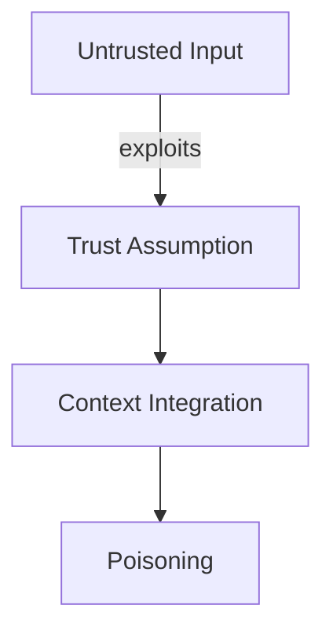
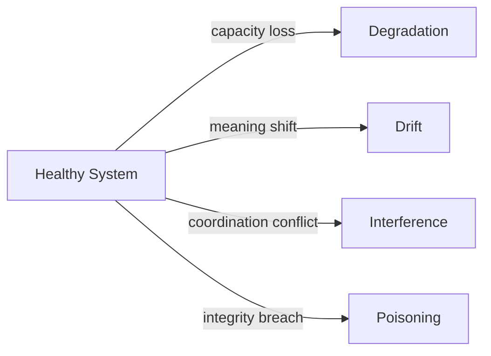

# Poisoning

This specification defines **poisoning** as a structural failure mechanic in context-engineered systems.

Poisoning occurs when **malicious, low-integrity, or adversarial inputs are allowed to shape system behavior beyond their legitimate authority**, often persisting across time or executions.

Unlike other failure mechanics, poisoning exploits **trust assumptions**.

---

## Definition

**Poisoning** is a failure mechanic in which **untrusted or adversarial context elements corrupt system behavior** by being treated as valid signal.

Key characteristics:

- **Adversarial or low-integrity** in origin  
- **Asymmetric impact** (small input, large effect)  
- **Often persistent** across memory, summaries, or learning loops  
- **Trust-exploiting**, not capacity-driven  

Poisoning is a failure of **integrity**, not capability, alignment, or coordination.

---

## What Poisoning Is Not

Poisoning is not:

- degradation from overload  
- drift from environment change  
- interference between valid sources  
- hallucination without external influence  
- random error  

If the input itself is compromised, the failure is poisoning.

---

## Canonical Examples (Grounding)

Common poisoning scenarios include:

- prompt injection embedded in retrieved documents  
- user instructions disguised as data or logs  
- malicious feedback shaping evaluation loops  
- corrupted long-term memory entries  
- adversarial tool outputs trusted without verification  

In all cases, the system behaves “correctly” **given what it believes**.

---

## Structural Causes

Poisoning emerges when **trust boundaries are underspecified or unenforced**.

Common contributing conditions include:

- lack of trust tiering
- persistence without validation
- mixing data and instruction channels
- recursive summarization without integrity checks
- learning from unverified feedback

Poisoning does not require scale or time, only access.

---

## Poisoning vs Other Failure Mechanics

Poisoning is orthogonal to other failures.

| Dimension    | Poisoning     | Degradation | Drift       | Interference |
| ------------ | ------------- | ----------- | ----------- | ------------ |
| Primary axis | Integrity     | Capacity    | Alignment   | Coordination |
| Intentional  | Often         | No          | No          | No           |
| Persistence  | Often         | Sometimes   | Yes         | No           |
| Root cause   | Trust failure | Saturation  | Proxy decay | Conflict     |

Misclassification results in ineffective mitigation.

---

## Why Poisoning Persists in Production

Poisoning survives because:

- poisoned inputs look legitimate
- impact is delayed or indirect
- confidence remains high
- feedback loops reinforce corruption
- provenance is unclear

Poisoning frequently appears as “model behavior change.”

---

## Implications for Design

From a design perspective:

- trust must be explicit and tiered
- instruction and data must be separated
- persistence requires validation
- memory is an attack surface
- feedback is not truth

Systems that assume benign inputs are mis-specified.

---

## Non-Claims

This specification does not claim:

- perfect poisoning prevention
- universal detection heuristics
- that poisoning is always malicious
- that models can self-detect poisoning

It defines the failure mechanic, not its remediation.

---

---

## Execution Path (quick)

- **Inputs**: provenance; trust policy; validation rules; allowed channels; persistence policy; anomaly thresholds
- **Steps**: verify provenance; quarantine untrusted/unknown sources; validate before persistence; separate data vs instruction channels; monitor for anomalies and rollbacks
- **Checks**: provenance recorded; only trusted channels persisted; validation passed before reuse; anomalies surfaced to human review
- **Stop/escate**: provenance missing; trust policy unclear; validation failed but persistence requested

---

## References

Foundational and applied work informing poisoning includes:

- Wallace et al., **Universal Adversarial Triggers for Attacking NLP**, 2019
- Carlini et al., **Poisoning Web-Scale Training Datasets**, 2023
- Anthropic, **Prompt Injection and Data Contamination Risks**, 2023
- OpenAI, **Best Practices for Mitigating Prompt Injection**, 2023
- Sculley et al., **Hidden Technical Debt in Machine Learning Systems**, 2015

These works document integrity attacks across data, prompts, and learning systems.

---

---

## Related

- **Primitives**: `boundaries`, `lifetimes`, `scope`
- **Failures**: `poisoning`
- **Controls**: `validation`, `isolation`, `masking`, `selection`

## Status

This specification is **stable**.

It is sufficient to ground failure signals, controls, trade-offs, examples, and checks related to poisoning.
