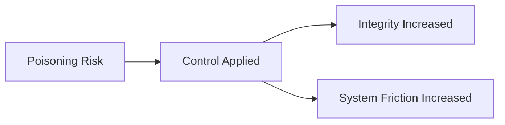
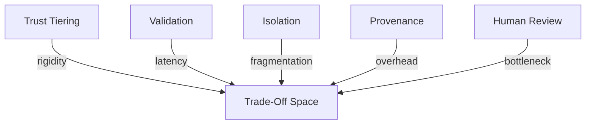

# Poisoning — Trade-Offs

This document enumerates the **structural trade-offs** introduced when applying controls to mitigate poisoning.

Poisoning mitigation trades **speed and autonomy** for **integrity and reversibility**.  
These trade-offs are non-negotiable in systems exposed to untrusted inputs.

---

## Trade-Off Model

Poisoning controls reduce risk by **raising the cost of influence**.

Systems that deny this cost accumulate hidden corruption.

---

## Trade-Offs by Control

### Trust Tiering

**What it improves**

- prevents authority escalation
- clarifies legitimacy of inputs
- constrains instruction masquerading

**What it constrains**

- flexibility in interpreting inputs
- emergent behavior from mixed sources

**Irreversibility**

- mis-tiered inputs may be permanently constrained

**When this becomes dangerous**

- trust assignment is wrong or outdated
- tiers are treated as static truths

Trust tiering protects integrity by reducing adaptability.

---

### Validation

**What it improves**

- blocks persistence of false or adversarial content
- limits reinforcement loops
- enforces correctness thresholds

**What it constrains**

- responsiveness
- throughput
- real-time adaptation

**Irreversibility**

- delayed acceptance may block legitimate updates

**When this becomes dangerous**

- validation criteria lag reality
- validation becomes ceremonial

Validation protects integrity by slowing change.

---

### Isolation

**What it improves**

- limits blast radius
- prevents systemic corruption
- localizes damage

**What it constrains**

- information sharing
- coordination
- holistic reasoning

**Irreversibility**

- isolated contexts cannot influence others without bridges

**When this becomes dangerous**

- system requires global awareness
- coordination cost exceeds integrity risk

Isolation protects integrity by fragmenting interaction.

---

### Provenance Tracking

**What it improves**

- enables audit and rollback
- preserves source accountability
- supports targeted remediation

**What it constrains**

- storage
- implementation simplicity
- privacy handling

**Irreversibility**

- missing provenance cannot be reconstructed later

**When this becomes dangerous**

- provenance exists but is ignored
- lineage is incomplete

Provenance protects integrity by preserving history.

---

### Human Review

**What it improves**

- resolves ambiguous trust cases
- detects sophisticated attacks
- authorizes irreversible actions

**What it constrains**

- scalability
- speed
- consistency

**Irreversibility**

- human decisions redefine acceptable state

**When this becomes dangerous**

- review authority is unclear
- review becomes rubber-stamping

Human review protects integrity by asserting judgment.

---

## Cross-Control Trade-Offs

Controls amplify each other’s costs.

Common compound risks:

- **Trust tiering + validation** → slow adaptation
- **Isolation + provenance** → operational complexity
- **All controls combined** → brittle, low-autonomy systems

Trade-offs must be evaluated as a system, not individually.

---

## Trade-Off Invariants

The following always hold:

- Increasing integrity reduces autonomy.
- Preventing poisoning increases friction.
- Persistence requires justification.
- Reversibility has operational cost.

Any design that denies these is mis-specified.

---

## Trade-Off Visibility Requirement

All poisoning controls must surface trade-offs explicitly.

Acceptable mechanisms:

- quarantine states
- delayed writes
- trust downgrade logs
- rollback procedures

Hidden integrity costs become latent corruption.

---

## Relationship to Governance

Poisoning mitigation is security- and governance-dominant.

As poisoning risk increases:

- automation retreats
- human authority expands
- reversibility becomes mandatory

Poisoning is resolved by **controlling who can change the system**.

---

## References

Trade-offs described here align with findings in:

- Wallace et al., **Universal Adversarial Triggers for Attacking NLP**, 2019
- Carlini et al., **Poisoning Web-Scale Training Datasets**, 2023
- Anthropic, **Prompt Injection and Data Contamination Risks**, 2023
- Sculley et al., **Hidden Technical Debt in Machine Learning Systems**, 2015

These works show that integrity preservation necessarily constrains speed and autonomy.

---

## Status

This document is **stable**.

Trade-offs listed here are considered exhaustive for poisoning mitigation at the failure-mechanics level.
