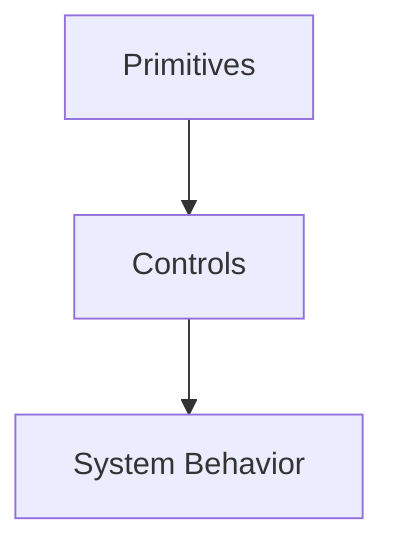

# Control Mechanisms — Index

This document defines the **control layer contract** for this repository.

Controls are **enforcement mechanisms**.  
They exist because primitives impose constraints that must be upheld at runtime.

Controls do not define intent.  
Controls do not redefine primitives.  
Controls operationalize constraints.

---

## What a Control Is

A **control mechanism** is a deliberate, enforceable intervention that:

- upholds one or more primitives
- operates at runtime or during orchestration
- has explicit trade-offs
- can be audited for effect

Controls answer the question:

> *How do we enforce a constraint that already exists?*

---

## What a Control Is Not

Controls are **not**:

- best practices
- heuristics presented as advice
- prompt phrasing tips
- model-specific tricks
- replacements for primitives

If a mechanism relies on “the model will probably…”, it is not a control.

---

## Control–Primitive Contract

Every control **must map back to at least one primitive**.

If a control cannot be justified by primitive pressure, it does not belong here.

| Primitive | Enforced By Controls |
|----------|----------------------|
| Attention | Compression, Ordering, Caching |
| Boundaries | Isolation, Trust |
| Scope | Masking, Routing |
| Lifetimes | Validation, Promotion, Demotion |
| Signal vs Noise | Selection, Filtering |

Controls may enforce multiple primitives, but **must not violate any**.

---

## Canonical Control Categories

The repository recognizes the following control categories.

These are **normative**.

### Attention Controls
Enforce finite capacity.
- Compression
- Ordering
- Caching

### Boundary Controls
Enforce influence limits.
- Isolation
- Trust

### Scope Controls
Enforce applicability.
- Masking
- Routing

### Lifetime Controls
Enforce temporal validity.
- Validation
- Promotion
- Demotion

### Signal Controls
Enforce relevance.
- Selection
- Filtering

No additional categories may be introduced without review.

---

## Control Authoring Rules

Every control document **must** include:

1. **Primitive Justification**  
   Which primitives force this control to exist.

2. **Failure Signals**  
   What happens when this control is absent or weak.

3. **Trade-Offs**  
   What flexibility or capability is lost.

4. **Examples**  
   How enforcement changes system behavior.

5. **Checks**  
   How to verify the control is working.

A control without checks is unenforceable.

---

## Control Boundaries

Controls must obey the following invariants:

- Controls enforce constraints; they do not invent them.
- Controls may reduce capability; they must not claim optimization.
- Controls must be reversible unless enforcing persistence.
- Controls must surface trade-offs explicitly.

Any control that hides cost is incomplete.

---

## Composition with Primitives

Controls are downstream of primitive composition.

If a control appears to “fix” a problem without reference to primitives, the problem has been misdiagnosed.

---

## Governance Requirement

Introducing or modifying a control requires:

- explicit primitive mapping
- justification for trade-offs
- explanation of enforcement scope

Controls change system behavior.  
Behavior changes require accountability.

---

## What This Index Forbids

This index forbids:

- control documents that redefine primitives
- undocumented enforcement
- implicit trade-offs
- model-specific controls masquerading as general mechanisms

Violations undermine the entire repository.

---

## How to Use This Index

When designing or reviewing a control:

1. Identify the primitive pressure.
2. Verify no primitive is violated.
3. Enumerate trade-offs.
4. Define enforcement checks.
5. Reject if any step is unclear.

Controls that cannot be explained structurally should not be built.

---

## Status

This index is **stable**.

It is the authoritative contract governing all control mechanisms in this repository.
