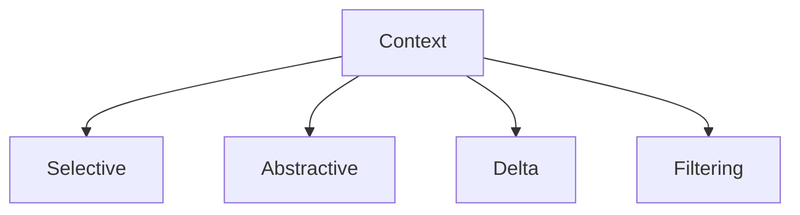

# Compression

This specification defines **compression** as a control mechanism that enforces finite attention by reducing context volume while preserving task-relevant signal.

Compression does not optimize reasoning.  
It **prevents attention collapse**.

---

## Definition

**Compression** is the deliberate transformation of context into a smaller representation such that:

- attention pressure is reduced
- critical signal remains accessible
- noise is removed or down-weighted

Compression always loses information.  
The only question is *which* information is lost.

---

## Primitive Justification

Compression exists because:

- attention is finite
- signal competes for limited capacity
- context accumulation degrades performance

Compression enforces:
- **Attention** by reducing load
- **Signal vs Noise** by removing low-value material

Without compression, long-running systems degrade predictably.

---

## What Compression Is Not

Compression is **not**:

- summarization by default
- paraphrasing for style
- truncation without intent
- storage optimization

If a method reduces tokens without preserving signal, it is truncation, not compression.

---

## Compression Targets

Compression may apply to:

- message history
- retrieved documents
- intermediate artifacts
- plans and traces
- tool outputs

Compression must declare its target explicitly.

---

## Compression Modes

Compression can be applied in distinct modes.



Each mode introduces different risks.

```mermaid
flowchart LR
    Raw[Raw Context] --> Comp[Compression]
    Comp --> Keep[Kept Signal (smaller)]
    Comp --> Lost[Lost Detail/Noise]
    Keep --> Attention[Attention Survives]
```

---

### Selective Compression

Removes entire low-signal segments.

- keeps high-signal items intact
- discards noise wholesale

Risk:

- misclassification of signal
- brittle behavior if selection is wrong

---

### Abstractive Compression

Rewrites content into a shorter abstraction.

- preserves intent
- removes detail

Risk:

- loss of nuance
- introduction of interpretation bias

---

### Delta Compression

Retains only changes since last state.

- prevents repetition
- stabilizes long sessions

Risk:

- loss of context for late readers
- dependency on prior state integrity

---

### Filtering Compression

Applies rule-based or heuristic pruning.

- deterministic
- auditable

Risk:

- rigid exclusion
- blind spots

---

## Compression Failure Signals

Compression failure is present when:

- critical constraints disappear
- behavior improves after disabling compression
- summaries contradict source context
- late-stage decisions lack justification

Compression failures often masquerade as “model mistakes”.

---

## Trade-Offs

Compression introduces unavoidable trade-offs:

- **Pros**

  - reduced degradation
  - longer stable sessions
  - clearer attention focus

- **Cons**

  - information loss
  - bias toward dominant signals
  - increased orchestration complexity

Compression shifts responsibility from the model to the system designer.

---

## Interaction with Other Controls

Compression must compose with:

- **Selection**: to identify what to keep
- **Masking**: to respect scope
- **Validation**: when compressed artifacts persist
- **Ordering**: to preserve precedence

Compression without composition causes hidden failures.

---

## Non-Claims

This specification does not claim:

- that compression improves accuracy
- that smaller context is always better
- that compression can be automated safely
- that compression is reversible

Compression is a risk management tool.

---

---

## Execution Path (quick)

- **Inputs**: compression policy; source artifacts with provenance; budget targets; validation rules
- **Steps**: select compressible items; summarize with provenance; preserve constraints non-compressible; validate summaries; record deltas
- **Checks**: budget met; provenance retained; constraints intact; validation passed; original available for audit
- **Stop/escate**: constraint would be compressed/dropped; provenance missing; validation fails

---

## Status

This specification is **stable**.

It provides sufficient grounding to define compression failure signals, examples, and enforcement checks.
