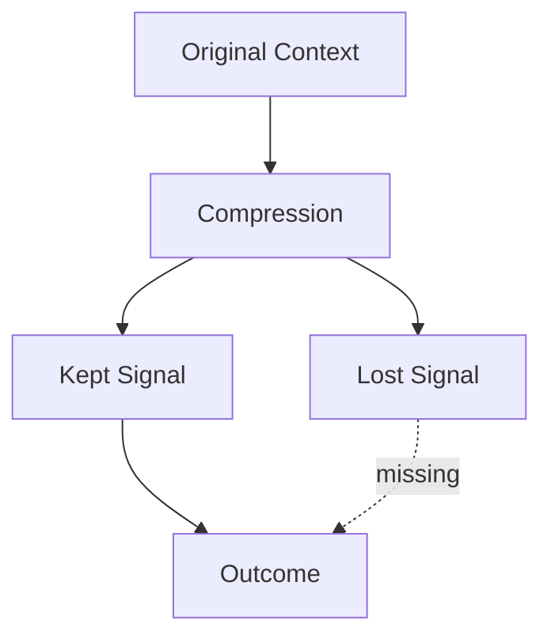

# Compression — Failure Signals

This document enumerates **observable signals** indicating that compression is absent, misapplied, or over-applied.

Compression failures are **attention-governance failures**.  
They often present as reasoning errors, but originate in context transformation.

---

## Signal Model

Compression fails when **signal is removed, distorted, or mis-prioritized** during reduction.

If outcomes degrade because critical signal was lost or reordered, compression has failed.

---

## Under-Compression Signals

### Attention Saturation

Observed behaviors:

- performance degrades as context grows
- constraints intermittently ignored
- late context dominates early constraints

Interpretation:

- insufficient reduction
- attention pressure unresolved

Primary downstream failures:

- degradation
- interference

---

### Redundancy Accumulation

Observed behaviors:

- repeated facts and constraints
- summaries of summaries
- context window fills without new information

Interpretation:

- no deduplication
- delta compression absent

---

## Over-Compression Signals

### Constraint Loss

Observed behaviors:

- safety or policy constraints disappear
- outputs violate explicit requirements
- corrections appear ignored

Interpretation:

- critical signal removed
- compression too aggressive

Primary downstream failures:

- interference
- policy breach

---

### Nuance Collapse

Observed behaviors:

- outputs become generic
- edge cases ignored
- explanations oversimplified

Interpretation:

- abstraction removed necessary detail
- abstractive compression misapplied

---

## Distortion Signals

### Semantic Drift Introduced by Compression

Observed behaviors:

- summaries contradict source
- intent subtly changes
- conclusions differ from inputs

Interpretation:

- abstraction injected interpretation
- compression altered meaning

Primary downstream failures:

- drift

---

### Priority Inversion

Observed behaviors:

- secondary considerations dominate
- critical constraints appear late or weak
- ordering affects compliance

Interpretation:

- compression disrupted precedence
- ordering not preserved

Primary downstream failures:

- interference

---

## Temporal Compression Signals

### Late-Reader Failure

Observed behaviors:

- downstream components misinterpret compressed artifacts
- context assumes prior state that is unavailable

Interpretation:

- delta compression without recovery path
- dependency on hidden history

Primary downstream failures:

- interference
- degradation

---

### Stale Compression Artifacts

Observed behaviors:

- old summaries continue to guide behavior
- updates fail to propagate

Interpretation:

- compressed artifacts not refreshed
- lifetime misaligned

Primary downstream failures:

- drift

---

## Control Interaction Signals

### Compression Without Selection

Observed behaviors:

- important content removed arbitrarily
- relevance not considered

Interpretation:

- compression applied without signal discrimination

---

### Compression Without Masking

Observed behaviors:

- scoped content compressed into global artifacts
- task-specific constraints leak

Interpretation:

- scope violated during compression

Primary downstream failures:

- interference

---

## Distinguishing Compression Failure from Other Failures

| Observation                   | Compression Failure?     |
| ----------------------------- | ------------------------ |
| Wrong answer                  | Possibly                 |
| Improves when context reduced | Yes                      |
| Violates scope                | Possibly (Scope/Masking) |
| Long-session degradation      | Often                    |
| Single bad input persists     | No (Lifetime)            |

Compression failures concern **how context is transformed**, not whether it is correct.

---

## Detection Guidance

Compression failures are detected by:

- disabling compression temporarily
- comparing compressed vs raw outcomes
- auditing what was removed
- reordering compressed content
- checking constraint survival

If removing compression improves behavior, compression is mis-specified.

---

## When to Escalate

Escalation is required when:

- safety constraints disappear
- summaries contradict source
- late-stage behavior lacks justification
- performance degrades with compression enabled

Compression failures compound silently in long-running systems.

---

## Status

This document is **stable**.

Signals listed here are sufficient to detect compression failures before they manifest as systemic degradation or interference.
