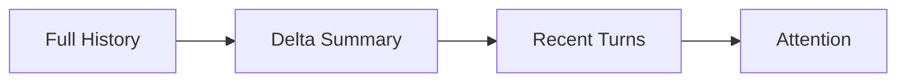
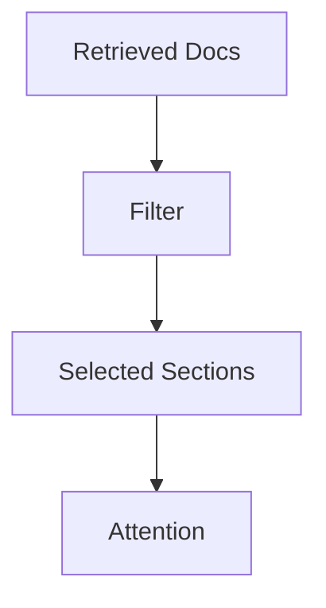
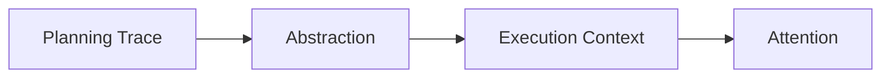
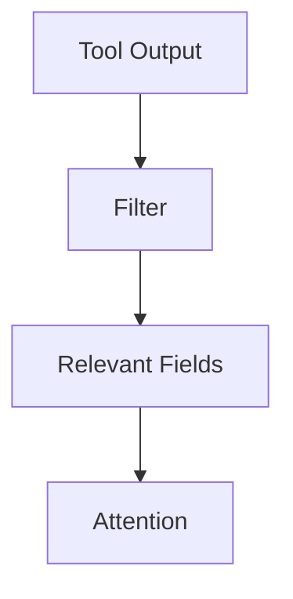
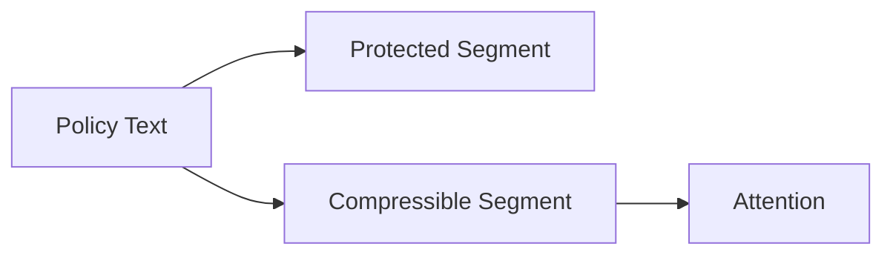

# Compression — Examples

This document provides **execution-grounded examples** showing how compression enforces attention constraints, where it fails, and how different compression modes change system behavior.

These examples focus on **context transformation**, not output quality alone.

---

## Example 1: Long-Running Conversation History

### Context

A conversational agent retains full message history across a long session.  
Over time, the context window approaches capacity.

---

### Failure (Without Compression)

Observed behavior:
- early constraints are ignored
- later messages dominate decisions
- responses become inconsistent

Root cause:
- attention saturation
- no reduction of historical context

Downstream failures:
- degradation
- interference

---

### Compression Applied

**Mode**: Delta compression  
**Target**: Message history

- retain last N turns verbatim
- summarize earlier turns into deltas
- remove repeated acknowledgements

---

### Outcome

- constraints remain visible
- long sessions stabilize
- attention pressure reduced predictably

---

## Example 2: Retrieval-Augmented Generation (RAG)

### Context

A RAG system retrieves multiple documents per query.  
Documents are long and partially overlapping.

---

### Failure (Without Compression)

Observed behavior:

- duplicated facts dominate attention
- weak constraints buried
- retrieval volume degrades quality

Root cause:

- redundancy
- no deduplication or abstraction

Downstream failures:

- degradation

---

### Compression Applied

**Mode**: Selective + Filtering  
**Target**: Retrieved documents

- remove duplicate passages
- keep only sections matching query intent
- discard background context

---

### Outcome

- higher relevance density
- stable performance under high recall
- reduced noise

---

## Example 3: Planning Trace Compression

### Context

An agent produces a detailed planning trace with alternatives, assumptions, and dead ends.  
Only the final plan is needed for execution.

---

### Failure (Without Compression)

Observed behavior:

- execution hesitates
- discarded alternatives reappear
- output appears indecisive

Root cause:

- planning signal treated as execution signal

Downstream failures:

- interference

---

### Compression Applied

**Mode**: Abstractive  
**Target**: Planning trace

- summarize plan rationale
- remove alternatives
- retain final decision and constraints

---

### Outcome

- decisive execution
- clean phase separation
- reduced interference

---

## Example 4: Tool Output Compression

### Context

A tool returns verbose logs and metadata.  
Only the result and error conditions are relevant.

---

### Failure (Without Compression)

Observed behavior:

- logs overwhelm context
- error signals buried
- model misinterprets tool success

Root cause:

- unfiltered tool output
- noise dominance

Downstream failures:

- degradation

---

### Compression Applied

**Mode**: Filtering  
**Target**: Tool output

- remove logs
- keep result, status, and errors
- tag provenance

---

### Outcome

- clearer tool interpretation
- stable downstream reasoning
- predictable attention usage

---

## Example 5: Over-Compression Failure

### Context

A safety-critical system compresses policy text aggressively to save space.

---

### Failure (Over-Compression)

Observed behavior:

- key safety constraints disappear
- outputs violate policy
- corrections fail intermittently

Root cause:

- critical signal removed
- compression depth exceeded tolerance

Downstream failures:

- interference
- policy breach

---

### Corrective Action

- reduce compression depth
- elevate constraints as non-compressible
- add validation check

---

### Outcome

- constraints preserved
- compression remains effective
- safety restored

---

## Example Invariants

Across all examples:

- compression stabilizes long contexts
- failures emerge when signal is misclassified
- abstraction introduces interpretation risk
- disabling compression is a useful diagnostic

If removing compression improves behavior, compression is misapplied.

---

## Status

This document is **stable**.

Examples provided here are sufficient to demonstrate compression as a control mechanism enforcing attention constraints.
