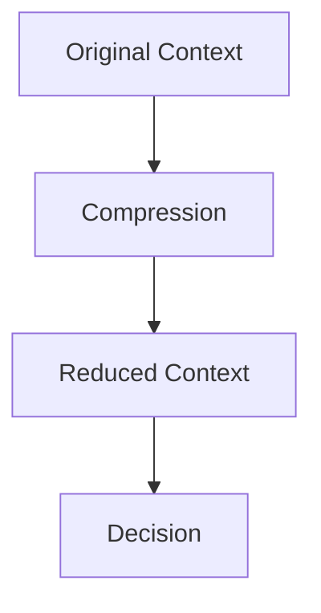

# Compression — Checks

This document defines **executable checks** to verify that compression is enforcing attention constraints without destroying task-critical signal.

Compression checks are **context-integrity checks**, not quality or correctness checks.

This system may appear to “work” while silently failing compression checks.

---

## Check Model

Compression checks verify that **reduced context still preserves required influence**.

If decisions diverge because critical signal was removed or distorted, compression has failed.

---

## Check 1: Signal Survival

**Question**  
Do all critical constraints survive compression?

**How to run**

- Identify mandatory constraints and invariants.
- Compare behavior with and without compression.

**Pass criteria**

- Constraints remain enforceable.
- Violations occur only when constraints are intentionally removed.

**Fail indicators**

- Safety rules disappear
- Hard requirements ignored
- Corrections partially apply

**Associated failures**

- Interference
- Policy breach

---

## Check 2: Noise Reduction Effectiveness

**Question**  
Does compression actually reduce attention pressure?

**How to run**

- Measure context size before and after compression.
- Observe performance as context grows.

**Pass criteria**

- Reduced context size
- Stable behavior across long sessions

**Fail indicators**

- Minimal size reduction
- Performance degrades despite compression

**Associated failures**

- Degradation

---

## Check 3: Semantic Fidelity

**Question**  
Does compressed content preserve original meaning?

**How to run**

- Compare compressed artifacts to source material.
- Look for contradictions or reinterpretations.

**Pass criteria**

- No semantic inversion
- Intent preserved

**Fail indicators**

- Summaries contradict source
- Abstraction injects judgment

**Associated failures**

- Drift

---

## Check 4: Compression Scope Integrity

**Question**  
Does compression respect scope boundaries?

**How to run**

- Inspect whether scoped context is merged improperly.
- Verify task- or role-specific content remains isolated.

**Pass criteria**

- Scoped content remains scoped
- No cross-task or cross-role leakage

**Fail indicators**

- Task constraints appear globally
- Role-specific instructions bleed

**Associated failures**

- Interference

---

## Check 5: Lifetime Alignment

**Question**  
Are compressed artifacts refreshed or expired appropriately?

**How to run**

- Track how long compressed summaries persist.
- Force expiration and observe behavior.

**Pass criteria**

- Compressed artifacts expire or refresh
- Stale summaries do not dominate decisions

**Fail indicators**

- Old summaries persist indefinitely
- Updates do not propagate

**Associated failures**

- Drift
- Poisoning

---

## Check 6: Late-Reader Safety

**Question**  
Can downstream components interpret compressed context correctly without hidden state?

**How to run**

- Feed compressed context to a fresh execution path.
- Observe whether behavior remains coherent.

**Pass criteria**

- Compressed artifacts are self-sufficient
- No reliance on unseen prior state

**Fail indicators**

- Hidden dependencies
- Incomplete interpretation

**Associated failures**

- Degradation
- Interference

---

## Check 7: Reversibility and Auditability

**Question**  
Can compression decisions be audited and reversed?

**How to run**

- Inspect logs or artifacts showing what was removed.
- Attempt to regenerate uncompressed context.

**Pass criteria**

- Compression steps are traceable
- Original context can be reconstructed or reloaded

**Fail indicators**

- Irreversible loss without record
- No visibility into removal decisions

**Associated failures**

- Governance failure

---

## Minimal Compression Audit (Checklist)

A system minimally conforms if all are true:

- [ ] Critical signal survives compression
- [ ] Attention pressure is measurably reduced
- [ ] Meaning is preserved
- [ ] Scope boundaries are respected
- [ ] Lifetimes are aligned
- [ ] Late readers can operate safely
- [ ] Compression is auditable

Failure of any item indicates compression failure.

---

## When to Re-run These Checks

Re-run compression checks when:

- context volume increases
- new compression modes are introduced
- summaries persist across sessions
- behavior degrades under load
- safety constraints disappear

Compression failures are subtle and accumulate silently.

---

## Status

This document is **stable**.

Checks listed here are sufficient to verify compression as a control mechanism enforcing attention constraints.
