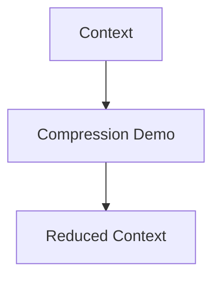

# Compression Scripts

Demo scripts for compression modes (selective, abstractive, delta, filtering). Keep them illustrative; do not treat them as production utilities.

```mermaid
flowchart TD
    Input[Context] --> Script[Compression Demo]
    Script --> Output[Reduced Context]
```
