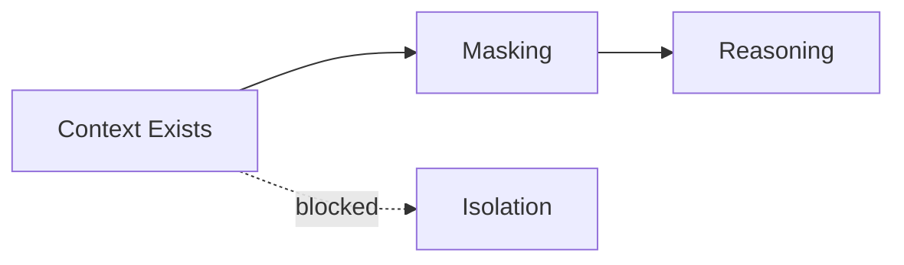
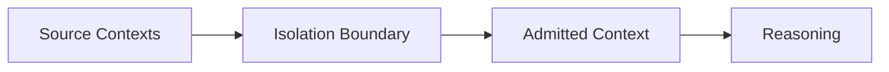

# Isolation

This specification defines **isolation** as a control mechanism that enforces **hard non-interaction guarantees** between contexts, roles, tasks, phases, or systems.

Isolation is not visibility control.  
Isolation is **influence prevention by construction**.

If masking says “this should not be seen,” isolation says “this cannot affect anything even if it exists.”

---

## Definition

**Isolation** is the deliberate construction of execution boundaries such that:

- context in one boundary cannot influence another
- failures do not propagate across boundaries
- authority does not leak across domains

Isolation answers the question:

> *What must never be able to affect what, under any circumstances?*

If the answer relies on discipline or conventions, isolation is absent.

---

## Primitive Justification

Isolation exists because:

- boundaries must sometimes be absolute, not conditional
- untrusted or experimental context must not influence stable systems
- governance requires non-negotiable separation
- some failures must be contained, not corrected

Isolation enforces:

- **Boundaries** by preventing cross-boundary influence
- **Scope** by making scope violations impossible
- **Lifetimes** by ensuring expired domains cannot resurface

Without isolation, masking and validation remain soft guarantees.

---

## What Isolation Is Not

Isolation is not:

- masking (visibility control)
- ordering (precedence control)
- validation (eligibility control)
- compression (capacity control)

If context can influence behavior through any path, isolation has not occurred.

---

## Isolation Targets

Isolation may apply between:

- tasks running in parallel
- roles with different authority
- phases (planning vs execution)
- trusted vs untrusted inputs
- experimental vs production systems
- user-facing vs system-facing logic
- evaluation vs generation

Isolation must declare **what is separated and why**.

---

## Isolation Types

### Logical Isolation
Separate execution paths or reasoning graphs.

### Contextual Isolation
Separate context assemblies with no shared artifacts.

### Authority Isolation
Prevent lower-authority context from affecting higher-authority decisions.

### Temporal Isolation
Prevent past context from influencing future sessions.

### System Isolation
Separate entire subsystems or agents.

Isolation type determines enforcement strength.

---

## Isolation vs Masking

Masking restricts *visibility*.  
Isolation restricts *possibility*.

If masking fails, influence may still occur.  
If isolation exists, failure is contained.

---

## Isolation Boundaries

An isolation boundary must be:

- explicit
- enforceable
- non-bypassable
- testable

Implicit boundaries are documentation, not isolation.

---

## Isolation Placement in the Pipeline

Isolation is applied **before** context assembly and reasoning.

Anything admitted past the boundary is assumed safe.

---

## Isolation Failure Signals

Isolation is failing when:

- untrusted input affects protected decisions
- experimental behavior leaks into stable paths
- parallel tasks influence each other
- clearing one subsystem changes another’s behavior
- failures cascade across domains

These failures are typically labeled “interference” or “poisoning.”  
The root cause is missing isolation.

---

## Trade-Offs

Isolation introduces costs:

- duplicated context
- increased orchestration
- reduced reuse
- higher system complexity

These costs are intentional. Isolation optimizes for safety and containment, not efficiency.

---

## Minimal Conformance

A system minimally conforms to this specification if:

- at least one non-bypassable isolation boundary exists
- untrusted or experimental context cannot affect protected logic
- cross-task or cross-role influence is impossible by construction
- isolation failure would require code or system changes, not prompt changes

Anything weaker is coordination, not isolation.

---

---

## Execution Path (quick)

- **Inputs**: isolation policy (tenants/tasks/roles); channel boundaries; memory separation rules; routing table
- **Steps**: route inputs/outputs per isolation domains; prevent cross-tenant/task/role leakage; separate memories; restrict tool access per domain
- **Checks**: no cross-domain artifacts; tools scoped per domain; memories separated; audit trails intact
- **Stop/escate**: domain ambiguous; shared state required without policy; attempted cross-domain access

---

## References

- Process and memory isolation in operating systems
- Fault containment and blast-radius reduction in distributed systems
- Secure sandboxing and trust boundary design
- Multi-tenant system isolation patterns

---

---

## Related

- **Primitives**: `boundaries`, `scope`
- **Failures**: `interference`, `poisoning`
- **Controls**: `isolation`

## Status

This specification is **stable**.

It defines isolation as a hard control mechanism enforcing absolute boundaries where masking and validation are insufficient.
