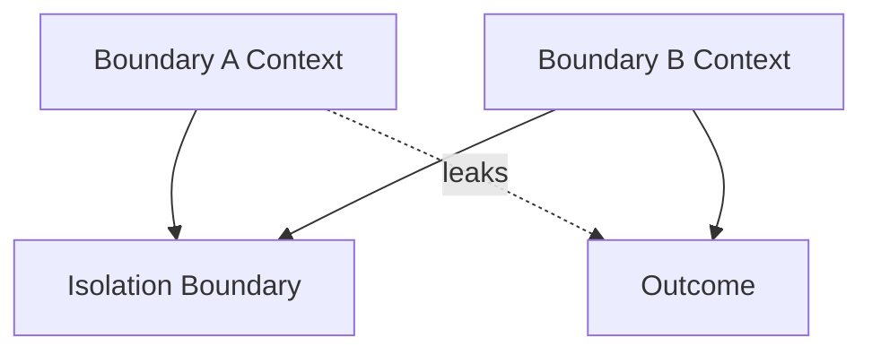

# Isolation — Failure Signals

This document enumerates **observable signals** indicating that isolation is absent, porous, or bypassed.

Isolation failures are **containment failures**.  
They occur when influence crosses a boundary that was intended to be absolute.

---

## Failure Model

Isolation fails when **cross-boundary influence occurs**, regardless of intent or correctness.

If leakage is possible, isolation is not present.

---

## Cross-Task Contamination Signals

### Parallel Task Influence

Observed behaviors:

- Task A constraints affect Task B outputs
- Outputs vary when parallel tasks are reordered or removed

Interpretation:

- task isolation missing
- shared context assembly

Primary downstream failures:

- interference

---

### Residual Task State

Observed behaviors:

- completed task assumptions influence new tasks
- “decisions so far” persist across tasks

Interpretation:

- temporal isolation missing
- lifetime boundaries unenforced

Primary downstream failures:

- interference
- drift

---

## Authority Boundary Signals

### Untrusted-to-Trusted Influence

Observed behaviors:

- user-provided text shapes system decisions
- speculative external content affects policies or routing

Interpretation:

- authority isolation missing
- trust boundary porous

Primary downstream failures:

- poisoning

---

### Experimental-to-Stable Leakage

Observed behaviors:

- experimental prompts affect production outputs
- A/B test logic bleeds into stable paths

Interpretation:

- environment isolation missing

Primary downstream failures:

- interference
- poisoning

---

## Phase Leakage Signals

### Planning-to-Execution Leakage

Observed behaviors:

- alternatives and assumptions appear during execution
- hedging language persists after commitment

Interpretation:

- phase isolation missing

Primary downstream failures:

- interference

---

### Evaluation-to-Generation Leakage

Observed behaviors:

- outputs optimize for evaluation criteria
- scoring language appears in generation

Interpretation:

- evaluation not isolated

Primary downstream failures:

- interference

---

## System Boundary Signals

### Subsystem Influence

Observed behaviors:

- clearing one subsystem changes another’s behavior
- unrelated agents affect each other’s outputs

Interpretation:

- system-level isolation missing

Primary downstream failures:

- interference

---

### Failure Propagation

Observed behaviors:

- errors cascade across domains
- fault in one area destabilizes the whole system

Interpretation:

- blast radius not contained
- isolation absent

Primary downstream failures:

- degradation

---

## Masking Misdiagnosed as Isolation

### Visibility ≠ Isolation

Observed behaviors:

- context hidden but still influential
- “masked” content affects reasoning indirectly

Interpretation:

- masking used where isolation required

Primary downstream failures:

- interference

---

## Validation Misdiagnosed as Isolation

### Rejection ≠ Containment

Observed behaviors:

- rejected artifacts still influence outcomes
- invalid context affects downstream reasoning

Interpretation:

- validation without isolation
- reuse paths bypass validation

Primary downstream failures:

- poisoning

---

## Distinguishing Isolation Failure from Other Failures

| Observation                    | Isolation Failure?    |
| ------------------------------ | --------------------- |
| Context ignored                | No (Ordering)         |
| Context hidden but influential | Yes                   |
| Context reused incorrectly     | Possibly (Validation) |
| Context absent                 | No (Selection)        |
| Cross-domain influence         | Yes                   |

Isolation failures concern **impossibility**, not priority or eligibility.

---

## Detection Guidance

Isolation failures are detected by:

- removing entire boundaries and observing behavior changes
- introducing adversarial content across domains
- forcing failures in one subsystem and observing propagation
- tracing influence paths across roles and tasks

If influence crosses a boundary by accident, isolation is missing.

---

## When to Escalate

Escalation is required when:

- untrusted content affects protected decisions
- parallel tasks are not independent
- experimental logic leaks into stable systems
- failures propagate across domains

Isolation failures represent governance and safety risk, not just quality loss.

---

## Status

This document is **stable**.

Signals listed here are sufficient to detect isolation failures before they propagate into interference, poisoning, or systemic instability.
