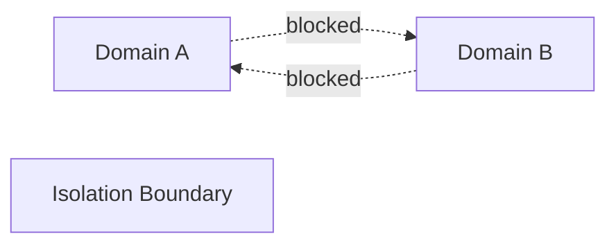

# Isolation — Trade-Offs

Isolation enforces **non-interaction**. It trades **reuse and flexibility** for **safety and containment**.

---

## Core Trade-Off

Isolation reduces **blast radius** by **forbidding interaction**.

If interaction is required, isolation cannot be absolute.

---

## Strong Isolation

**Improves**
- prevents cross-domain poisoning and interference
- contains failures
- clarifies authority and responsibility

**Costs**
- duplicated context and state
- increased orchestration complexity
- reduced parallelism and shared learning

---

## Weak Isolation

**Improves**
- ease of coordination
- reuse of artifacts
- faster iteration

**Costs**
- leakage across tasks/roles
- higher interference/poisoning risk
- harder to reason about blast radius

---

## Isolation vs Masking

**Isolation**
- makes influence impossible without breaking the boundary
- safer, but more rigid

**Masking**
- hides context but may leak influence
- more flexible, less safe

Choosing masking where isolation is required is a design defect.

---

## Temporal Isolation

**Enforced session/phase boundaries**
- prevent stale context from resurfacing
- increase reset/rehydration cost

**Loose temporal isolation**
- cheaper resets
- higher drift/ghost-context risk

---

## Authority Isolation

**Hard gates on low-trust sources**
- reduce poisoning
- may block legitimate signals

**Soft gates**
- more permissive
- higher contamination risk

---

## Automation vs Human Override

**Automated isolation**
- deterministic, fast
- brittle to misconfiguration

**Human override paths**
- allow exceptions with accountability
- risk erosion of boundaries if overused

Overrides must be explicit, logged, and rare.

---

## Invariants

- Isolation always adds coordination and duplication cost.
- If a boundary can be bypassed without code/system change, isolation is not present.
- Overuse of overrides weakens isolation to masking.
- Isolation is justified when the cost of leakage exceeds the cost of duplication.

Any claim of “zero-cost isolation” is mis-specified.

---

## Status

This document is **stable**.  
Isolation decisions must make these trade-offs explicit before implementation.
