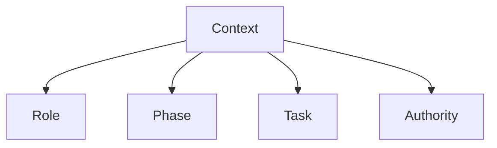

# Masking

This specification defines **masking** as a control mechanism that **prevents context from influencing parts of the system where it is not applicable**.

Masking does not remove context.  
It **constrains where context is allowed to act**.

Selection decides *whether* context is admitted.  
Masking decides *where admitted context is visible*.

---

## Definition

**Masking** is the deliberate restriction of context visibility based on scope, role, phase, or authority.

Masked context may exist in the system but **cannot exert influence outside its permitted domain**.

Masking answers the question:

> *Who is allowed to see this, and when?*

---

## Primitive Justification

Masking exists because:

- scope limits applicability
- boundaries limit influence
- signal relevance is role- and phase-dependent

Masking enforces:
- **Scope** by preventing out-of-scope influence
- **Boundaries** by isolating roles and authority
- **Signal vs Noise** by preventing irrelevant influence

Without masking, scoped context leaks.

---

## What Masking Is Not

Masking is **not**:

- deletion
- compression
- summarization
- selection

If context is removed, selection or compression occurred.  
If context exists but cannot influence, masking occurred.

---

## Masking Targets

Masking may apply to:

- system instructions
- user input
- retrieved documents
- memory entries
- tool outputs
- evaluation criteria

Masking must declare **what is masked and from whom**.

---

## Masking Dimensions

Masking operates across multiple dimensions.



A mask may apply along one or more dimensions.

```mermaid
flowchart LR
    C[Context Pool] --> Mask[Mask by Role/Phase/Task/Authority]
    Mask --> Visible[Visible Context]
    Mask --> Hidden[Hidden (no influence)]
```

---

## Common Masking Forms

### Role Masking

- policy visible to reasoning, not execution
- evaluation criteria hidden from generation

### Phase Masking

- planning context hidden during execution
- execution artifacts hidden during evaluation

### Task Masking

- task-specific constraints isolated
- parallel tasks do not contaminate each other

### Authority Masking

- low-authority inputs blocked from high-impact decisions

---

## Masking Failure Signals

Masking failure is present when:

- policy language shapes execution output
- evaluation criteria bias reasoning
- task-specific context leaks globally
- untrusted input affects high-authority decisions

Masking failures typically manifest as **interference**.

---

## Trade-Offs

Masking introduces unavoidable trade-offs:

- **Pros**

  - reduced interference
  - clearer responsibility boundaries
  - predictable behavior

- **Cons**

  - increased orchestration complexity
  - harder debugging
  - risk of over-isolation

Masking shifts complexity from the model to the system.

---

## Interaction with Other Controls

Masking must compose with:

- **Selection**: determines what is eligible to be masked
- **Compression**: masked content may still need reduction
- **Routing**: directs masked context to correct components
- **Validation**: masked persistent artifacts require re-checks

Masking without composition causes hidden coupling.

---

## Non-Claims

This specification does not claim:

- that masking improves output quality
- that masking removes risk entirely
- that masking is static
- that masking replaces governance

Masking enforces separation, not correctness.

---

## Status

This specification is **stable**.

It provides sufficient grounding to define masking failure signals, trade-offs, examples, and enforcement checks.
