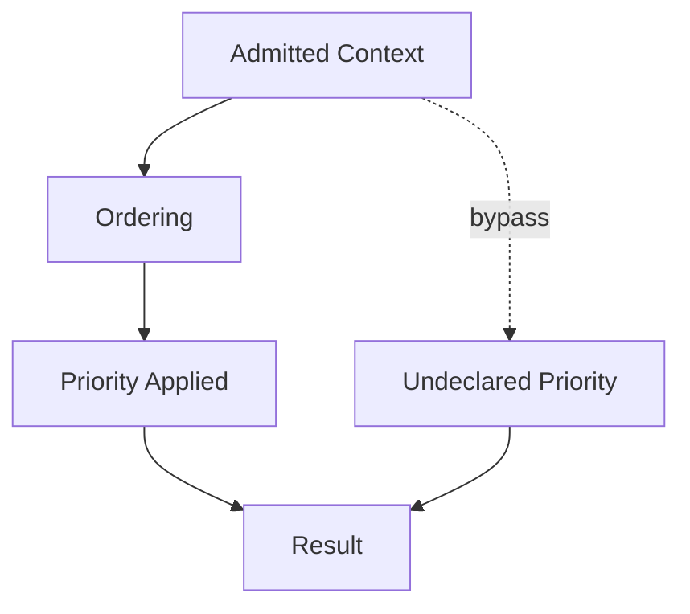

# Ordering — Failure Signals

This document enumerates **observable signals** indicating that ordering is absent, implicit, or misapplied.

Ordering failures occur when **admitted context competes without declared precedence**, allowing position, recency, or verbosity to decide influence.

---

## Failure Model

Ordering fails when **priority is undefined or violated**, even though the correct context is present.

If reordering context changes outcomes materially, ordering has failed.

---

## Position Bias Signals

### Late Override of Invariants

Observed behaviors:

- safety constraints ignored after long background
- early rules overridden by later examples
- outputs depend on input order

Interpretation:

- precedence not enforced
- position bias determining influence

Primary downstream failures:

- degradation
- interference

---

### Front-Loaded Noise

Observed behaviors:

- verbose introductions dominate reasoning
- disclaimers outweigh constraints
- background context suppresses intent

Interpretation:

- importance inferred from position, not role

Primary downstream failures:

- degradation

---

## Recency Bias Signals

### Fresh Context Overrules Authority

Observed behaviors:

- recent user input overrides system constraints
- late tool output dominates decisions

Interpretation:

- recency treated as priority
- authority axis ignored

Primary downstream failures:

- interference

---

### Legacy Constraint Suppression

Observed behaviors:

- long-standing invariants fade
- behavior shifts over time without intent change

Interpretation:

- recency-first ordering
- lifetime ignored

Primary downstream failures:

- drift

---

## Authority Inversion Signals

### Low-Authority Precedence

Observed behaviors:

- untrusted content shapes high-impact decisions
- speculative input treated as directive

Interpretation:

- authority not encoded in ordering

Primary downstream failures:

- interference
- poisoning

---

### High-Authority Dilution

Observed behaviors:

- system instructions inconsistently applied
- policies appear optional

Interpretation:

- authority signals buried
- no precedence enforcement

Primary downstream failures:

- degradation

---

## Constraint Visibility Signals

### Constraint Exists but Is Ignored

Observed behaviors:

- explicit rules violated
- corrections reference existing constraints

Interpretation:

- constraint present but deprioritized

Primary downstream failures:

- interference

---

### Constraint Sensitivity to Placement

Observed behaviors:

- moving a rule earlier fixes behavior
- same content behaves differently by position

Interpretation:

- implicit ordering
- no declared precedence

Primary downstream failures:

- degradation

---

## Phase Ordering Signals

### Phase Context Misprioritized

Observed behaviors:

- planning context outweighs execution context
- evaluation criteria influence generation

Interpretation:

- phase precedence not enforced

Primary downstream failures:

- interference

---

## Ordering–Compression Confusion

### Compression Masks Ordering Failure

Observed behaviors:

- aggressive compression required to restore behavior
- removing content fixes issues

Interpretation:

- ordering not enforced
- compression compensating for precedence failure

Primary downstream failures:

- degradation

---

## Distinguishing Ordering Failure from Other Failures

| Observation                | Ordering Failure? |
| -------------------------- | ----------------- |
| Context exists but ignored | Yes               |
| Removing context helps     | Possibly          |
| Reordering changes outcome | Yes               |
| Context absent             | No (Selection)    |
| Meaning altered            | No (Compression)  |

Ordering failures concern **precedence**, not eligibility or content.

---

## Detection Guidance

Ordering failures are detected by:

- shuffling context order
- isolating constraints to first position
- testing authority-first layouts
- enforcing explicit precedence rules

If behavior depends on input order, ordering is underspecified.

---

## When to Escalate

Escalation is required when:

- constraints are intermittently ignored
- authority is overridden by recency
- behavior shifts after reordering inputs

Ordering failures are subtle and often blamed on model inconsistency.

---

## Status

This document is **stable**.

Signals listed here are sufficient to detect ordering failures before they propagate into degradation or interference.
