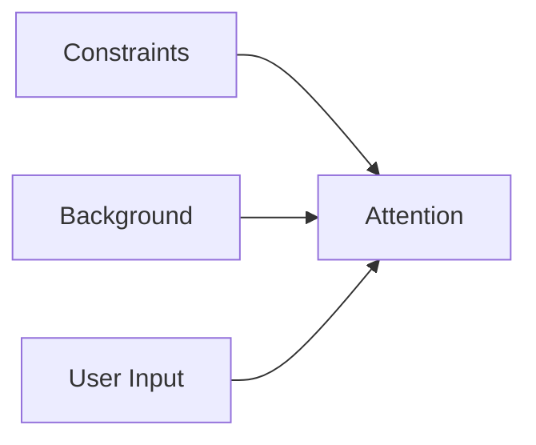
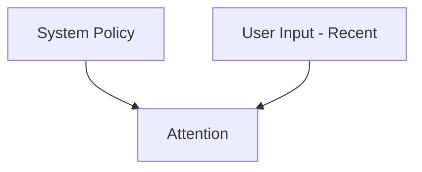
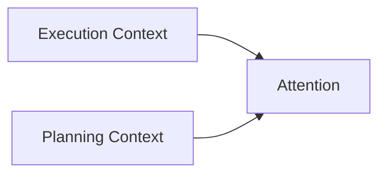
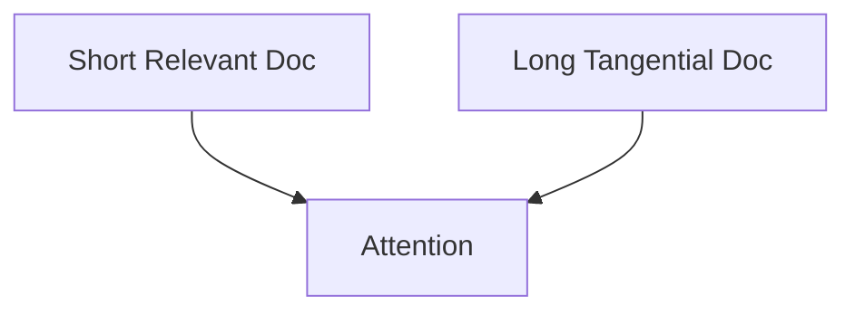
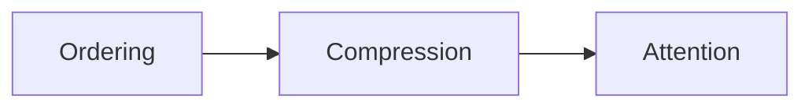

# Ordering — Examples

This document provides **concrete, execution-oriented examples** showing how ordering determines precedence among admitted context elements, how failures appear, and how explicit ordering changes outcomes.

Examples focus on **precedence and dominance**, not correctness of content.

---

## Example 1: Constraint Exists but Is Ignored

### Context

A system prompt contains:
- a safety constraint
- a long explanatory background
- a user request that partially conflicts with the constraint

All content is selected and visible.

---

### Failure (Without Explicit Ordering)

Observed behavior:
- output violates the safety constraint
- background explanation dominates reasoning
- user request overrides invariant

Root cause:
- no precedence defined
- model infers dominance from verbosity and position

Downstream failures:
- degradation
- interference

---

### Ordering Applied

**Strategy**: Constraint-first, authority-first  
**Rule**: Invariants precede all other context

Constraints are ordered first and treated as non-overridable.

---

### Outcome

- constraint consistently enforced
- background remains informative but subordinate
- behavior becomes predictable

---

## Example 2: Recency Bias Overrides Policy

### Context

A long session includes:

- system-level policy
- evolving user interaction
- late user instruction conflicting with policy

---

### Failure (Recency-First Ordering)

Observed behavior:

- late user instruction overrides policy
- policy appears optional
- outputs shift over time

Root cause:

- recency treated as priority
- authority axis ignored

Downstream failures:

- interference
- drift

---

### Ordering Applied

**Strategy**: Authority-first, recency-second

Authority is encoded explicitly in ordering.

---

### Outcome

- policy consistently enforced
- user interaction remains flexible within bounds
- drift arrested

---

## Example 3: Phase Context Misprioritized

### Context

An agent operates in:

1. Planning
2. Execution

Planning includes alternatives and assumptions.

---

### Failure (Without Phase Ordering)

Observed behavior:

- execution hesitates
- alternatives reappear
- output includes hedging

Root cause:

- planning and execution context unordered
- phase relevance ignored

Downstream failures:

- interference

---

### Ordering Applied

**Strategy**: Phase-first ordering

Execution context takes precedence during execution.

---

### Outcome

- decisive execution
- clean phase separation
- reduced interference

---

## Example 4: Retrieved Documents Compete Unevenly

### Context

A RAG system retrieves:

- a short, precise document
- a long, tangential document

Both are relevant and selected.

---

### Failure (Without Ordering)

Observed behavior:

- long document dominates reasoning
- short document ignored

Root cause:

- length interpreted as importance
- no explicit precedence

Downstream failures:

- degradation

---

### Ordering Applied

**Strategy**: Relevance-first ordering

Relevance score determines position, not length.

---

### Outcome

- high-signal content dominates
- noise demoted without removal
- stable behavior under varied inputs

---

## Example 5: Ordering Failure Masked by Compression

### Context

A system aggressively compresses context to stabilize behavior.

---

### Failure (Misdiagnosis)

Observed behavior:

- disabling compression causes erratic behavior
- aggressive compression required

Root cause:

- unordered constraints and background
- compression compensating for precedence failure

Downstream failures:

- degradation

---

### Corrective Action

- restore full context
- apply explicit ordering
- reduce compression depth

Ordering applied **before** compression.

---

### Outcome

- lower compression required
- clearer influence hierarchy
- improved stability

---

## Example Invariants

Across all examples:

- ordering determines which signal survives competition
- position and recency dominate without enforcement
- ordering failures appear as ignored constraints
- reordering content is a valid diagnostic

If moving context changes behavior, ordering is underspecified.

---

## Status

This document is **stable**.

Examples provided here are sufficient to demonstrate ordering as a control mechanism governing precedence among admitted context.
